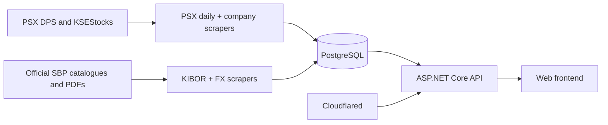

# WebICT Capital market-data platform schema

Canonical database, ingestion, API, and frontend contract for the PSX/SBP
platform.

| Item | Contract |
|---|---|
| Database | PostgreSQL 14 or newer |
| Database schema | `public` |
| Business timezone | `Asia/Karachi` |
| Date/time exchange | ISO 8601; PostgreSQL `date` for logical dates and `timestamptz` for instants |
| Frontend access | Through the API only; never connect the browser directly to PostgreSQL |
| Schema changes | Forward-only SQL migrations for existing databases; the complete DDL below is for a fresh database |

## Purpose and authority

This file is the cross-service source of truth for:

- table, view, key, relationship, and data-type semantics;
- which scraper owns each write surface;
- scheduling and dependency order;
- API read models and frontend consumption rules;
- idempotency, history, freshness, and recovery behavior; and
- the complete schema expected by a fresh installation.

It is documentation, not a migration runner. On an existing production
database, apply the numbered migrations in order. Do **not** paste the complete
DDL section over an existing database.

When this file, a scraper, and an API DTO disagree, stop the deployment and
resolve the mismatch. Do not silently coerce one source into another semantic
shape.

## System topology



The PostgreSQL service is the durable system of record. Scraper containers are
workers invoked by Dokploy schedules. The ASP.NET Core API is the only supported
application read boundary, and Cloudflared exposes that API without exposing
PostgreSQL.

## Runtime services and schedules

All cron expressions below are interpreted in `Asia/Karachi`. Dokploy runs the
command inside the already-deployed service container. Containers remain idle
between jobs; internal Python schedulers must remain disabled.

| Order | Dokploy service | Command | Cron | Local schedule | Purpose |
|---:|---|---|---|---|---|
| 1 | `PsxSummaryScraper` | `/usr/local/bin/python -u /app/parse_psx.py` | `30 17 * * 1-5` | 17:30 Mon–Fri | PSX closing rates, market breadth, KSE indexes, missing-date recovery, and latest-day AI brief |
| 2 | `PsxSummaryScraper` | `/usr/local/bin/python -u /app/compute_technicals.py` | Deployment-defined | After the daily import | Raw-price technical indicators for changed security histories |
| 3 | `KiborScraper` | `/usr/local/bin/python -u /app/sbp_kibor.py` | `10 18 * * 1-5` | 18:10 Mon–Fri | Official SBP KIBOR publications |
| 4 | `SbpFxRates` | `/usr/local/bin/python -u /app/sbp_fx_rates.py --max-publications 100` | `40 18 * * 1-5` | 18:40 Mon–Fri | Official SBP FX publications and normalized observations |
| 5 | `TickerScraper` | `/usr/local/bin/python -u /app/psx_scraper.py --all-securities --no-json` | `20 19 * * 1,3,5` | 19:20 Mon/Wed/Fri | Company profiles, equity, valuation, fundamentals, ratios, announcements, payouts, and reports |

The gaps reduce load on the database and upstream sites. They are operational
spacing, not a correctness mechanism: every importer must remain transactionally
safe and idempotent if jobs overlap or are retried. A job should fail fast when
its own advisory lock cannot be acquired; the PSX daily and company importers
must use distinct locks.

The always-on services are PostgreSQL, the ASP.NET Core API, and Cloudflared.
They do not belong in the scraper schedule.

`compute_technicals.py` is also a one-shot command. Its container remains idle
between Dokploy invocations; it has no internal scheduler. Schedule it after a
successful daily import at a deployment-appropriate time, or invoke it on
demand with `--full`, `--symbol SYMBOL`, or `--dry-run`.

## Ownership and source mapping

### PSX daily market importer

`parse_psx.py` owns the daily market facts.

| Data | Authoritative source | Write surface |
|---|---|---|
| Listed symbols and company names | PSX DPS closing-rate publication | `security` |
| Ticker OHLC, change, section, and turnover | PSX DPS closing-rate PDF | `daily_quote` |
| Whole-market volume and breadth | PSX DPS closing-rate PDF | `market_summary` |
| Current/latest KSE index snapshot | PSX DPS live index panels | `market_index`, `index_daily` |
| Historical KSE index snapshot | KSEStocks Market Summary | `market_index`, `index_daily` |
| Latest complete trading-day narrative | Configured LLM, using imported market facts | `market_ai_summaries` |

KSE index values must **never** be parsed from the closing-rate PDF. The PDF is
authoritative only for ticker rows and market-wide summary fields. The current
day routes to PSX DPS index panels; a historical day routes to KSEStocks.

Backfill completeness is determined from required rows for each candidate date,
not from `MAX(trade_date)` alone. A newer row must not hide an older hole. Each
date commits atomically, so a stopped run resumes from remaining incomplete
dates. A network or parsing failure is retryable and must not be recorded as a
holiday. The AI summary is skipped during historical backfill and is generated
only for the latest complete trading date.

### Technical-indicator calculator

`compute_technicals.py` is the sole writer of `technical_indicator_daily`.
`parse_psx.py` remains the owner of `daily_quote`; the calculator reads that
table and `security` but must never update, delete, or otherwise repair either
source table. It makes no external HTTP requests and produces no JSON files.

The calculator stores only `price_basis = 'raw'`. The schema permits an
`adjusted` basis for a future, separately specified pipeline, but no adjusted
prices currently exist and consumers must not interpret raw indicators as
split- or dividend-adjusted. `calculation_version` is calculation metadata, not
part of the primary key: recalculating a security with a new version replaces
the row for the same security, date, and price basis.

The worker validates its source and destination columns, then holds the
session-level PostgreSQL advisory lock named `psx_technical_indicators` for the
run. Each security is a separate transaction. Thus an interrupted or partially
failed run preserves completed securities and safely rediscovers unfinished
ones on its next invocation. If execution is interrupted during an active
security, that transaction is explicitly rolled back before the advisory lock
is released, so the unlock commit cannot commit partial indicator work.

Initial and recovery behavior:

- when `technical_indicator_daily` is empty, every security with quote history
  is processed from its first quote through its latest quote;
- otherwise, a security is affected when an eligible positive-close quote has
  no raw technical row, its `daily_quote.updated_at` is distinct from the
  matching `technical_indicator_daily.source_updated_at`, or the stored
  calculation version is not current. A security is also affected when an
  existing raw technical row's source close becomes null, non-positive, or
  non-finite;
- `--full` explicitly selects all quote histories and `--symbol MEBL` explicitly
  selects one complete history; `--dry-run` calculates and reports without
  writing or deleting;
- every affected security is recalculated from complete quote history, not from
  a short lookback, so a historical correction repairs all later recursive
  EMA, RSI, MACD, and ATR values; and
- conditional UPSERTs use `IS DISTINCT FROM`, so an identical rerun is a no-op
  and preserves `calculated_at`. After recalculation, every raw row whose date
  is absent from the exact eligible-date set is removed, including rows whose
  source quote still exists but has become null, non-positive, or non-finite.
  Cleanup never touches future adjusted-basis rows and is not restricted by
  calculation version.

Only actual trading observations participate. Rows with a null, non-finite, or
non-positive close are skipped, and calendar/weekend rows are never generated.
Close drives price indicators; `turnover` drives the volume indicator.
These recovery and transaction-safety corrections require no database migration.

### PSX company importer

`psx_scraper.py`, `psx_company_transform.py`, and `psx_company_db.py` form one
logical importer. `security` is the shared issuer dimension; the daily importer
defines its universe and the company importer may only enrich a nonblank company
name.

| Component | Write surface | Persistence rule |
|---|---|---|
| Profile | `company_profile_version` | SCD2, one current version per security |
| Shares/free float | `equity_profile_version` | SCD2; market cap is deliberately excluded |
| Market capitalization | `daily_valuation` | Daily fact tied to the latest quote date not after the Karachi run date |
| Statements | `financial_statement` | SCD2 by security, fiscal year, and period |
| Ratios | `financial_ratio` | SCD2 by security and fiscal year |
| Announcements | `announcement` | Append/correct by issuer-scoped document ID, otherwise content hash |
| Payouts/results | `company_payout` | Append/correct by stable event hash |
| Financial-report files | `financial_report_document` | Append/correct by issuer-scoped document ID, otherwise content hash |

Each ticker is one transaction. A failed ticker rolls back without undoing
previous successful tickers in the same run. Missing or regressed optional data
must not replace a complete current SCD2 row. Re-importing identical content is
a no-op.

This importer does not write `daily_quote`, `market_summary`, `market_index`,
`index_daily`, `kibor_rate`, `fx_publication`, or `fx_rate_observation`.

### SBP KIBOR importer

`sbp_kibor.py` reads the official SBP publication catalogue and PDFs. It owns
`kibor_rate` and uses the `kibor` data-source code. The supported source tenors
are `1W`, `2W`, `1M`, `3M`, `6M`, `9M`, and `1Y`; each observation contains a
bid and offer for its publication date.

Backfill candidates come from the official catalogue. Therefore weekends and
holidays without a publication are not missing rows. A transient download or
parse failure remains retryable. An identical re-import must not alter values or
their `updated_at` timestamp.

### SBP FX importer

`sbp_fx_rates.py` reads official SBP catalogue entries and PDFs and uses the
`fx` data-source code. It owns `fx_publication` and `fx_rate_observation`.

One publication row records the source document and its logical dates. Its child
observations retain currency pair, tenor, and value shape. Four publication
families are intentionally distinct:

- `conversion`
- `open_market`
- `weighted_average_customer`
- `mark_to_market`

Consumers must retain both `rate_type` and `tenor`; rates with different
semantics must never be blended into one series. A row contains either a single
positive `rate` or a positive ordered `bid`/`offer` pair, never both.

`v_sbp_fx_rates` is the full normalized query surface. For the platform's main
USD/PKR chart and PSX correlation, use `v_usdpkr_m2m_ready`, which selects only
Mark-to-Market USD/PKR `ready` observations. The older generic `fx_rate` table is
reserved for a future market-feed OHLC importer and is not populated by the SBP
PDF scraper.

As with KIBOR, publication discovery is catalogue-driven. A missing catalogue
entry is not synthesized, and a failed download is not treated as a holiday.

## Provenance and source codes

Every importer registers or reuses a stable `data_source.code` and records
attempts in `scrape_run`. IDs are database-local surrogate keys; consumers use
the code.

| `data_source.code` | Owner / meaning |
|---|---|
| `psx_daily_import` | Orchestration/audit record for a PSX daily import |
| `psx_closing` | Official PSX closing-rate PDF facts |
| `dps_index` | Current PSX DPS index panels |
| `ksestocks_index` | Historical KSEStocks index summary |
| `psx_company` | PSX company pages and documents |
| `kibor` | Official SBP KIBOR publications |
| `fx` | Official SBP FX publications |
| `metals` | Reserved for a future metal-rate importer |

`scrape_run.status` has these meanings:

| Status | Meaning |
|---|---|
| `running` | Started but not finalized; an old row may indicate interruption |
| `success` | All requested components completed and committed |
| `partial` | Some components/tickers committed and warnings are recorded |
| `failed` | No valid completion for the requested unit of work |
| `no_data` | The authoritative catalogue/source confirms no applicable data; never use this for a transient error |

`rows_written` is an operational counter, not the final row count. UPSERTs,
corrections, deletes performed for complete-snapshot replacement, and no-op
conflicts can make it differ from table cardinality. Use fact-table queries to
verify stored coverage.

## Relational model and key semantics

### Stable dimensions and opaque IDs

`security.id`, `market_index.id`, publication IDs, and event IDs are surrogate
keys. Sequence values are expected to be sparse and non-contiguous because
PostgreSQL sequences are not rolled back and conflict attempts may consume
values. This is normal. APIs and frontend routes must identify securities by
`security.symbol` and indexes by `market_index.code`, never by display order or
the apparent size of an ID.

### Daily facts

Daily-series tables use a natural entity/date key and are safe to UPSERT:

| Table | Grain / key | Notes |
|---|---|---|
| `daily_quote` | one security per `trade_date` | Authoritative PSX ticker OHLC and turnover |
| `technical_indicator_daily` | one security, `trade_date`, and price basis | Derived raw-price indicators; current calculation version replaces the same basis row |
| `market_summary` | one `trade_date` | Market-wide breadth and volume |
| `index_daily` | one index per `trade_date` | Source is DPS or KSEStocks, never the PDF |
| `daily_valuation` | one security per `trade_date` | Full PKR market cap; company source value is multiplied by 1,000 |
| `kibor_rate` | one `quote_date` and tenor | Bid/offer point observation |
| `fx_rate` | one date/pair/tenor | Reserved generic OHLC surface |
| `metal_rate` | one date/metal/purity/unit | Reserved until a metal importer is deployed |

Trading and publication gaps are meaningful. APIs and charts must not fabricate
weekend or holiday observations and must not linearly interpolate them unless a
separate analytical feature explicitly requests it.

### Versioned facts (SCD2)

`company_profile_version`, `equity_profile_version`, `financial_statement`, and
`financial_ratio` use half-open validity intervals `[valid_from, valid_to)`.
Exactly one current row exists per natural key, enforced by partial unique
indexes.

| Import result | Required behavior |
|---|---|
| New complete content | Insert a current row |
| Identical `content_hash` | No write |
| Incomplete/regressed payload | Preserve current row and report a warning |
| Same-day corrected content | Update the current row because date precision cannot represent two same-day versions |
| Later corrected content | Close the current interval and insert a new current row |
| Run date older than `valid_from` | Reject the change |

Current-value API reads filter `is_current = true`. Historical/restatement reads
return validity fields and order by `valid_from`; they must not infer versions
from `updated_at`.

### Event and document history

Announcements, payouts, and financial-report documents are not deleted merely
because a later source response omits them. Stable source identifiers permit
metadata correction while preserving `first_seen`. Content hashes provide the
fallback identity where no source identifier exists.

PSX document IDs are issuer-scoped. Unique keys therefore include
`security_id`; a global unique document-ID index is invalid for this schema.

### Timestamp meaning

| Field | Meaning |
|---|---|
| `inserted_at` / `first_seen` | First successful observation; preserve it during corrections |
| `updated_at` on conditional importers | Last material stored-value change |
| `updated_at` on an unconditional PSX UPSERT | Last accepted observation/rerun, which may change even when values are equal |
| `valid_from` / `valid_to` | Business validity for SCD2 history |
| `generated_at` | AI-summary generation time |
| `source_updated_at` on a technical row | `daily_quote.updated_at` used by that calculation |
| `calculated_at` | First insert or most recent material indicator/version/source change; identical recalculation preserves it |
| `scrape_run.started_at` / `finished_at` | Operational run lifecycle |

Because some PSX UPSERTs are unconditional, clients must not universally treat
`updated_at` as proof that a business value changed. If change-only timestamps
are required later, those UPSERTs must add `IS DISTINCT FROM` predicates before
the contract is tightened.

## API contract

The ASP.NET Core API owns connection pooling and database reads. It uses one
shared `NpgsqlDataSource`; repositories execute parameterized queries. `/health`
is a liveness endpoint and intentionally does not make deployment health depend
on a temporary database outage.

### Existing read surfaces

| Consumer use | API surface | Primary database read set |
|---|---|---|
| Latest daily market page | Existing market-summary controller route | `market_summary`, `daily_quote`, `market_ai_summaries`, `index_daily`, `market_index` |
| Single ticker | `GET /api/tickers/{symbol}` | Security, quotes, raw `technical_indicator_daily`, valuation, current/versioned company facts, and events |
| Ticker comparison | `GET /api/tickers/compare?symbols=MEBL&symbols=HBL&benchmarks=KSE100` | Quotes, raw technicals, profile, equity, valuation, statements, ratios, and optional benchmark history for two to four symbols |
| KIBOR curve/history | `GET /api/rates/kibor` | `kibor_rate` bid/offer observations by publication `quote_date` and canonical tenor |
| Canonical USD/PKR | `GET /api/rates/usd-pkr` | `v_usdpkr_m2m_ready` point rates and publication metadata only |

The exact existing market-summary route remains defined by its controller; a
schema update must not rename it. Add the concrete route to API/OpenAPI docs
from the deployed controller rather than guessing it here.

Single-ticker query parameters:

| Parameter | Contract |
|---|---|
| `from`, `to` | Optional inclusive quote range; `from <= to`; dates earlier than `2021-01-01` resolve to `2021-01-01`; maximum resolved span is 10 years |
| `include` | Comma-separated subset of `quotes,profile,equity,valuation,financials,ratios,announcements,payouts,reports,technicals`; omitted means all sections |
| `financialYears` | Integer from 1 through 20 |
| `eventLimit` | Integer from 1 through 100 for bounded event/document lists |
| `includeRestatements` | When true, include historical SCD2 versions with validity metadata |

Symbols are trimmed and normalized to uppercase. Unknown symbols return HTTP 404;
malformed ranges, includes, limits, or comparisons return RFC-compatible
`ProblemDetails` with HTTP 400. Comparison accepts between two and four distinct
symbols and resolves the default shared quote range from the stock symbols so
chart points are comparable.

Comparison-specific query parameters:

| Parameter | Contract |
|---|---|
| `symbols` | Two to four distinct stock symbols; repeated values or comma-separated values are accepted and response order follows request order |
| `benchmark`, `benchmarks` | Zero to two distinct benchmark codes; repeated `benchmarks` values or comma-separated values are accepted; initially only canonical `market_index.code` benchmark codes from
`KSE100`, `KSE30`, `KMI30`, and `KSEALL`. |
| `from`, `to` | Optional inclusive range with the same date rules as single-ticker quote ranges |
| `include` | Comma-separated subset of `quotes,profile,equity,valuation,financials,ratios,technicals`; omitted means all comparison sections |
| `financialYears` | Integer from 1 through 20; omitted defaults to 5 |

Comparison benchmark codes are trimmed and normalized to uppercase, then resolved
through `market_index.code`; APIs must not depend on market-index IDs or display
order. Unsupported benchmark codes return HTTP 400. Missing supported benchmark
codes return HTTP 404 and identify all unresolved codes. Stock and benchmark
response order follows the normalized request order.

Comparison valuation is returned as its own object with an `asOf` date from
`daily_valuation.trade_date`. It must not be forward-filled onto a later quote
date. Quote rows may only carry valuation values joined on both `security_id`
and the exact `trade_date`.

The single-ticker response exposes technicals as `priceBasis`,
`calculationVersion`, nullable `asOf`, and ascending `points`. Each point carries
`tradeDate` plus the persisted return, moving-average, RSI, MACD, ATR, Bollinger,
and volume-SMA decimal fields. The public contract is fixed to `raw` and
`ta_raw_v1`; clients cannot select another basis or version. `asOf` is the last
actual row inside the inclusive requested range. The API does not forward-fill
or search before `from`. A requested technical section with no matching rows is
an empty raw/`ta_raw_v1` series; an unrequested section is null. The comparison
response reuses the same series DTO for both securities and the existing shared
requested range.

### Technical-indicator API semantics

Technical indicators are a derived read surface, never a replacement for the
authoritative quote series. When an API endpoint exposes them, it must join by
`security_id` and `trade_date`, filter `price_basis = 'raw'` and
`calculation_version = 'ta_raw_v1'`, and return the basis and version in the DTO
or in unambiguous response metadata. APIs must not silently label raw values as
adjusted.

Indicator rows align to actual eligible trading observations. Warm-up values
are null rather than zero: returns require their stated lag, SMA/Bollinger and
volume SMA require complete windows, EMA requires its initialization period,
RSI requires 14 changes, ATR requires 14 true ranges, and MACD signal requires
nine available MACD values. Return and RSI fields are percentage values already
expressed on a 0–100 scale where applicable; consumers must not multiply them by
100 again. Missing turnover produces a null `volume_sma_20` until the rolling
20-observation window is complete again.

`ta_raw_v1` formulas are:

| Column | Exact formula / initialization |
|---|---|
| `return_1d_pct`, `return_5d_pct`, `return_20d_pct` | `((current close / close N trading observations earlier) - 1) * 100` |
| `sma_20`, `sma_50`, `sma_200` | Arithmetic mean of the last N closes; complete N-observation window only |
| `ema_12`, `ema_26` | Adjust-false recursion with `alpha = 2 / (N + 1)` and `EMA[0] = close[0]`; hidden until N observations exist |
| `macd` | `ema_12 - ema_26`; first available with `ema_26` |
| `macd_signal` | Adjust-false EMA(9) of available MACD values, initialized at the first MACD and hidden until nine MACD values exist |
| `macd_histogram` | `macd - macd_signal` |
| `rsi_14` | Wilder gain/loss means seeded from the first 14 close changes, then `(previous_average * 13 + current) / 14`; RSI is `100 - 100 / (1 + average_gain / average_loss)` |
| `atr_14` | True range is `max(high-low, abs(high-previous_close), abs(low-previous_close))`; first observation uses `high-low`. Wilder ATR is seeded by the first 14 true ranges, then `(previous_atr * 13 + current_true_range) / 14` |
| `bollinger_middle` | `sma_20` |
| `bollinger_upper`, `bollinger_lower` | `sma_20 +/- 2 * population_stddev(last 20 closes)`, with population divisor 20 (`ddof=0`) |
| `volume_sma_20` | Arithmetic mean of the last 20 `turnover` observations; all 20 must be present |

For RSI, zero average loss with positive average gain is 100, zero average gain
with positive average loss is 0, and a completely flat gain/loss window is 50.
All non-finite calculation results are persisted as null.

### Rates API contract

Rates endpoints use the existing schema without a migration. Repositories read
these canonical surfaces:

| Feature | Canonical read surface | Required filters/dimensions |
|---|---|---|
| KIBOR curve/history | `kibor_rate` | `quote_date`, `tenor`; return bid and offer separately |
| Main USD/PKR series | `v_usdpkr_m2m_ready` | Optional date range only |
| FX explorer | `v_sbp_fx_rates` | Preserve and expose `rate_type`, `tenor`, `base_ccy`, and `quote_ccy` |
| FX publication provenance | `fx_publication` joined to observations | Use when the client requests source document metadata |

Do not map SBP bid/offer data into OHLC fields, average a spread into a rate, or
combine rate families. API decimals must remain decimals; do not convert them
through binary floating point.

`GET /api/rates/kibor` returns observations for `startDate` through `endDate`.
When both query parameters are omitted, the default range is `2025-01-01`
through `2025-12-31`. It does not accept tenor query arguments. The response is
constrained to the built-in canonical tenor set `1W, 2W, 1M, 3M, 6M, 9M, 1Y`.
`tenorOrder`, observations, and same-date curve values preserve that explicit
order. `latestCurve` uses one common latest `quoteDate`; it never takes a
different latest row per tenor. Bid and offer remain separate nullable decimals.

`GET /api/rates/usd-pkr` returns observations for `startDate` through `endDate`.
When both query parameters are omitted, the default range is `2025-01-01`
through `2025-12-31`. It reads exclusively from `v_usdpkr_m2m_ready` and always
identifies the response as pair `USD/PKR`, rate type `mark_to_market`, tenor
`ready`, label “SBP Mark-to-Market — Ready”, and unit “PKR per USD”. Each
ascending point contains `quoteDate`, decimal `rate`, and nullable
`effectiveDate`. `asOf` is the final actual point. The endpoint must not query
generic `fx_rate` or mix other rate types,
pairs, or mark-to-market tenors.

Both rate routes reject user query arguments and return the full canonical
source history. Empty canonical sources return HTTP 200 with empty point arrays
and null `asOf`/`asOfDate`. Neither endpoint forward-fills missing publication
dates. Configuration and database failures remain failures rather than empty
successful responses.

### API consistency and performance

- Use `market_summary.trade_date` as the authoritative date for a complete daily
  market response, then query quotes, indexes, and a completed AI summary for
  that same date. Do not independently choose `MAX(trade_date)` from every table.
- The index snapshot returned with a market day must use that requested market
  date, not the globally latest index date.
- Join `daily_valuation` by both security and quote date.
- Default company reads to current SCD2 rows; expose restatements only when the
  request asks for them.
- Bound event results and date spans. Add pagination before exposing unbounded
  historical event collections.
- Use a repeatable-read transaction or an equivalent single-snapshot query when
  composing a response from several tables.
- Never return `DATABASE_URL`, scraper notes containing credentials, content
  hashes, or internal lock identifiers to public clients.

## Frontend contract

The frontend consumes API DTOs, not database rows. Database names in this table
explain lineage only.

| Screen/feature | API data needed | Display rules |
|---|---|---|
| Market overview | Latest market summary, same-date indexes/tickers, completed AI brief | Show the trade date and source freshness; omit a missing/failed AI brief without hiding market facts |
| Ticker detail | Quotes, raw technical indicators, as-of valuation, current profile/equity, fundamentals, ratios, announcements, payouts, reports | Route by uppercase symbol; show available and requested quote ranges; label indicators as raw and preserve warm-up nulls |
| Ticker comparison | Two to four comparison items plus zero to two optional benchmark series on one shared stock range | Align series by actual trade date; preserve gaps; keep requested stock/benchmark order; label technical basis, valuation `asOf`, and fiscal period/year |
| KIBOR | `GET /api/rates/kibor` tenor-level bid/offer curve and history | Keep `1W, 2W, 1M, 3M, 6M, 9M, 1Y` order explicit; do not collapse bid and offer |
| USD/PKR | `GET /api/rates/usd-pkr` backed only by `v_usdpkr_m2m_ready` | Label “SBP Mark-to-Market — Ready”, unit “PKR per USD”; display quote/effective dates and source freshness |
| FX explorer | Full normalized FX surface through the API | Require/label rate type and tenor; render either a rate or bid/offer pair |

Frontend numeric rules:

- treat prices, ratios, rates, EPS, market capitalization, and percentages as
  decimal values; format only at presentation time;
- `market_cap` is full PKR, not thousands of PKR;
- `free_float_pct` is already a percentage value and must not be divided by 100;
- `turnover` and index `volume` are whole-number quantities;
- null means unavailable/not applicable, not zero; and
- date-only values must not shift under browser timezone conversion. Display
  logical dates as their ISO calendar date and render instants in
  `Asia/Karachi` unless the user explicitly selects another timezone.

For cache validation, future API work may derive ETags or `Last-Modified` values
from a response-level version/freshness calculation. It must not blindly use one
table's `updated_at` for a response composed from multiple tables.

## Deployment and migration procedure

### Existing production database

Apply migrations once, in order, using a role that owns or can alter the target
objects:

```bash
psql "$DATABASE_URL" -v ON_ERROR_STOP=1 -f migrations/001_psx_company_persistence.sql
psql "$DATABASE_URL" -v ON_ERROR_STOP=1 -f migrations/002_psx_company_idempotency.sql
psql "$DATABASE_URL" -v ON_ERROR_STOP=1 -f migrations/003_psx_company_constraints.sql
psql "$DATABASE_URL" -v ON_ERROR_STOP=1 -f migrations/004_sbp_fx_persistence.sql
psql "$DATABASE_URL" -v ON_ERROR_STOP=1 -f migrations/005_technical_indicators.sql
```

Migration `005_technical_indicators.sql` creates
`technical_indicator_daily`, its `(security_id, trade_date, price_basis)`
primary key, raw/adjusted basis check, quote foreign key with cascade delete,
and trade-date index. Production has already applied migration 005; this
document and the fresh-install DDL below describe that post-migration state.

Running these files through DBeaver is also valid when connected to the intended
database and `public` schema, auto-commit behavior is understood, and the whole
file is executed with stop-on-error behavior. Never apply a migration while
assuming that `IF NOT EXISTS` validates an incompatible pre-existing object;
run the verification queries after deployment.

Minimum post-migration checks:

```sql
SELECT current_database(), current_schema();

SELECT to_regclass('public.fx_publication')       AS fx_publication,
       to_regclass('public.fx_rate_observation')  AS fx_rate_observation,
       to_regclass('public.v_sbp_fx_rates')       AS v_sbp_fx_rates,
       to_regclass('public.v_usdpkr_m2m_ready')   AS v_usdpkr_m2m_ready,
       to_regclass('public.technical_indicator_daily') AS technical_indicator_daily;

SELECT conname, convalidated
FROM pg_constraint
WHERE conrelid IN (
    'public.scrape_run'::regclass,
    'public.fx_publication'::regclass,
    'public.fx_rate_observation'::regclass,
    'public.technical_indicator_daily'::regclass
)
ORDER BY conrelid::regclass::text, conname;
```

Deploy scraper/API code only after its required migrations are present. Each
service must validate the tables, columns, and unique indexes it owns before any
network or backfill work begins.

### Fresh database

For a new empty database, execute the complete DDL below once, then seed
`data_source` through the importers' normal UPSERT logic. The DDL intentionally
does not schedule jobs, create application users, grant privileges, or expose a
network port.

## Complete PostgreSQL schema (fresh installations only)

```sql
-- ============================================================================
-- Market Data Warehouse — schema.sql  (PostgreSQL 14+)
-- ============================================================================
-- Design goals
--   1. Scalable: PSX closing rates + company fundamentals today; KIBOR, USD/PKR,
--      gold & silver later. Adding a new daily series = one small table.
--   2. No redundancy for daily scrapes: every time-series table is keyed by
--      (entity, date). Re-running the same day UPSERTs in place.
--   3. Keep history when values change: slowly-changing facts (profile,
--      financials, ratios, share structure) are versioned (SCD2). A new row is
--      written ONLY when a content hash changes; otherwise the run is a no-op.
--
-- Two storage patterns
--   A) DAILY SERIES  -> PK ends in the observation date; ON CONFLICT DO UPDATE.
--   B) VERSIONED (SCD2) -> (natural_key..., content_hash, valid_from, valid_to,
--      is_current). One "current" row per key; superseded rows are retained.
--
-- content_hash: sha256 hex of the meaningful fields, computed in the scraper
-- (Python: hashlib.sha256(canonical_json.encode()).hexdigest()). Keeping it in
-- the app avoids a pgcrypto dependency and stays deterministic across engines.
-- ============================================================================

-- ---------------------------------------------------------------------------
-- 0. Provenance / run tracking (optional but cheap; good for debugging)
-- ---------------------------------------------------------------------------

CREATE TABLE data_source (
    id        smallserial PRIMARY KEY,
    code      text UNIQUE NOT NULL,          -- 'psx_closing','psx_company','kibor','fx','metals'
    name      text NOT NULL,
    base_url  text
);

CREATE TABLE scrape_run (
    id           bigserial PRIMARY KEY,
    source_id    smallint NOT NULL REFERENCES data_source(id),
    run_date     date NOT NULL,              -- logical trade/observation date
    started_at   timestamptz NOT NULL DEFAULT now(),
    finished_at  timestamptz,
    status       text NOT NULL DEFAULT 'running',
    rows_written integer NOT NULL DEFAULT 0,
    notes        text,
    CONSTRAINT ck_scrape_run_status
        CHECK (status IN ('running', 'success', 'partial', 'failed', 'no_data'))
);
CREATE INDEX idx_scrape_run_source_date ON scrape_run (source_id, run_date);


-- ---------------------------------------------------------------------------
-- 1. Dimensions (stable entities referenced by many facts)
-- ---------------------------------------------------------------------------

-- One row per listed symbol. symbol is the stable natural key.
CREATE TABLE security (
    id            bigserial PRIMARY KEY,
    symbol        text UNIQUE NOT NULL,       -- 'MEBL'
    company_name  text,                       -- latest seen name (convenience)
    created_at    timestamptz NOT NULL DEFAULT now(),
    updated_at    timestamptz NOT NULL DEFAULT now()
);

-- One row per market index (KSE100, KMIALLSHR, ...).
CREATE TABLE market_index (
    id            smallserial PRIMARY KEY,
    code          text UNIQUE NOT NULL,       -- 'KSE100'
    display_name  text
);


-- ---------------------------------------------------------------------------
-- 2. PSX daily series (from the closing-rate PDF)  [pattern A]
-- ---------------------------------------------------------------------------

-- Per-symbol daily OHLC bar. This is the authoritative daily price row.
CREATE TABLE daily_quote (
    security_id  bigint NOT NULL REFERENCES security(id),
    trade_date   date   NOT NULL,
    open         numeric,
    high         numeric,
    low          numeric,
    close        numeric,
    turnover     bigint,
    change       numeric,
    section      text,                        -- PSX sector/section label from the PDF
    source_id    smallint REFERENCES data_source(id),
    inserted_at  timestamptz NOT NULL DEFAULT now(),
    updated_at   timestamptz NOT NULL DEFAULT now(),
    PRIMARY KEY (security_id, trade_date)
);
CREATE INDEX idx_daily_quote_date ON daily_quote (trade_date);

-- Derived technical indicators. compute_technicals.py owns this table and
-- reads daily_quote without modifying it. The active implementation writes
-- raw prices only; adjusted is reserved for a future separately defined feed.
CREATE TABLE technical_indicator_daily (
    security_id         bigint NOT NULL,
    trade_date          date NOT NULL,
    price_basis         text NOT NULL DEFAULT 'raw',
    calculation_version text NOT NULL,

    return_1d_pct       numeric,
    return_5d_pct       numeric,
    return_20d_pct      numeric,

    sma_20              numeric,
    sma_50              numeric,
    sma_200             numeric,
    ema_12              numeric,
    ema_26              numeric,

    rsi_14              numeric,
    macd                numeric,
    macd_signal         numeric,
    macd_histogram      numeric,
    atr_14              numeric,

    bollinger_middle    numeric,
    bollinger_upper     numeric,
    bollinger_lower     numeric,
    volume_sma_20       numeric,

    source_updated_at   timestamptz NOT NULL,
    calculated_at       timestamptz NOT NULL DEFAULT now(),

    PRIMARY KEY (security_id, trade_date, price_basis),

    CONSTRAINT fk_technical_daily_quote
        FOREIGN KEY (security_id, trade_date)
        REFERENCES daily_quote (security_id, trade_date)
        ON DELETE CASCADE,

    CONSTRAINT ck_technical_price_basis
        CHECK (price_basis IN ('raw', 'adjusted'))
);

CREATE INDEX idx_technical_indicator_date
    ON technical_indicator_daily (trade_date);

-- Whole-market breadth/volume for the day. (KSE100/KSE30 header figures are
-- intentionally NOT stored here — they live in index_daily to avoid duplication.)
CREATE TABLE market_summary (
    trade_date   date PRIMARY KEY,
    prev_volume  bigint,
    curr_volume  bigint,
    advances     integer,
    declines     integer,
    unchanged    integer,
    flu_no       text,
    source_id    smallint REFERENCES data_source(id),
    inserted_at  timestamptz NOT NULL DEFAULT now(),
    updated_at   timestamptz NOT NULL DEFAULT now()
);

-- One generated market brief per trade date and summary type.
-- Historical backfills do not create summaries. Only the latest complete
-- imported trade date can create or update the daily_market_close summary.
CREATE TABLE IF NOT EXISTS market_ai_summaries (
    trade_date       date NOT NULL
                     REFERENCES market_summary(trade_date) ON DELETE CASCADE,
    summary_type     text NOT NULL DEFAULT 'daily_market_close',
    model_name       text NOT NULL,
    prompt_version   text NOT NULL,
    input_hash       char(64) NOT NULL,
    summary          text,
    error_message    text,
    key_points       jsonb NOT NULL DEFAULT '[]'::jsonb,
    top_gainers      jsonb NOT NULL DEFAULT '[]'::jsonb,
    top_losers       jsonb NOT NULL DEFAULT '[]'::jsonb,
    volume_leaders   jsonb NOT NULL DEFAULT '[]'::jsonb,
    sector_activity  jsonb NOT NULL DEFAULT '[]'::jsonb,
    generated_at     timestamptz NOT NULL DEFAULT now(),
    status           text NOT NULL DEFAULT 'pending'
                     CHECK (status IN ('pending', 'completed', 'failed')),
    PRIMARY KEY (trade_date, summary_type)
);

CREATE INDEX idx_market_ai_summaries_status
    ON market_ai_summaries (status);

CREATE INDEX idx_market_ai_summaries_latest_completed
    ON market_ai_summaries (summary_type, trade_date DESC)
    WHERE status = 'completed';

CREATE INDEX idx_market_ai_summaries_generated_at
    ON market_ai_summaries (generated_at DESC);

-- Per-index daily values (from the DPS site panel).
CREATE TABLE index_daily (
    index_id     smallint NOT NULL REFERENCES market_index(id),
    trade_date   date NOT NULL,
    prev_close   numeric,
    open         numeric,
    high         numeric,
    low          numeric,
    close        numeric,
    volume       bigint,
    change       numeric,
    change_pct   numeric,
    as_of        timestamptz,    -- exact snapshot time reported by the site
    source_id    smallint REFERENCES data_source(id),
    inserted_at  timestamptz NOT NULL DEFAULT now(),
    updated_at   timestamptz NOT NULL DEFAULT now(),
    PRIMARY KEY (index_id, trade_date)
);
CREATE INDEX idx_index_daily_date ON index_daily (trade_date);


-- ---------------------------------------------------------------------------
-- 3. Company page — daily vs. structural split
-- ---------------------------------------------------------------------------

-- DAILY [pattern A]: values that move every day with price.
-- market_cap = shares * close and P/E are price-driven, so they belong here,
-- NOT in the versioned equity/financial tables (otherwise every day = new row).
-- Company-page source convention: PSX labels market cap as "Market Cap (000's)".
-- The importer multiplies that source value by 1000; market_cap is full PKR.
-- A valuation is written only when the exact Karachi run date already exists
-- in daily_quote. On weekends, holidays, or a failed closing import it is
-- skipped rather than attaching a current value to an older trading date.
CREATE TABLE daily_valuation (
    security_id    bigint NOT NULL REFERENCES security(id),
    trade_date     date NOT NULL,
    market_cap     numeric,
    pe_ratio_ttm   numeric,
    source_id      smallint REFERENCES data_source(id),
    inserted_at    timestamptz NOT NULL DEFAULT now(),
    updated_at     timestamptz NOT NULL DEFAULT now(),
    PRIMARY KEY (security_id, trade_date),
    CONSTRAINT fk_daily_valuation_quote
        FOREIGN KEY (security_id, trade_date)
        REFERENCES daily_quote (security_id, trade_date)
        ON DELETE CASCADE,
    CONSTRAINT ck_daily_valuation_market_cap
        CHECK (market_cap IS NULL OR market_cap >= 0)
);
CREATE INDEX idx_daily_valuation_date ON daily_valuation (trade_date);

-- VERSIONED [pattern B]: company profile (sector, description, people, etc.).
-- Changes rarely; one current row per security, superseded rows retained.
CREATE TABLE company_profile_version (
    id                    bigserial PRIMARY KEY,
    security_id           bigint NOT NULL REFERENCES security(id),
    sector                text,
    business_description  text,
    address               text,
    website               text,
    registrar             text,
    auditor               text,
    fiscal_year_end       text,
    key_people            jsonb,        -- [{"name":..,"designation":..}, ...]
    content_hash          char(64) NOT NULL,
    valid_from            date NOT NULL,   -- run date this version first appeared
    valid_to              date,            -- NULL while current
    is_current            boolean NOT NULL DEFAULT true,
    inserted_at           timestamptz NOT NULL DEFAULT now(),
    CONSTRAINT ck_profile_version_interval
        CHECK (valid_to IS NULL OR valid_to > valid_from),
    CONSTRAINT ck_profile_version_current
        CHECK (
            (is_current AND valid_to IS NULL)
            OR (NOT is_current AND valid_to IS NOT NULL)
        )
);
CREATE UNIQUE INDEX uq_profile_current
    ON company_profile_version (security_id) WHERE is_current;
CREATE INDEX idx_profile_hist ON company_profile_version (security_id, valid_from);

-- VERSIONED [pattern B]: share structure (shares outstanding / free float).
-- Structural, not daily — market_cap deliberately excluded (see daily_valuation).
CREATE TABLE equity_profile_version (
    id                 bigserial PRIMARY KEY,
    security_id        bigint NOT NULL REFERENCES security(id),
    shares             bigint,
    free_float_shares  bigint,
    free_float_pct     numeric,
    content_hash       char(64) NOT NULL,
    valid_from         date NOT NULL,
    valid_to           date,
    is_current         boolean NOT NULL DEFAULT true,
    inserted_at        timestamptz NOT NULL DEFAULT now(),
    CONSTRAINT ck_equity_version_values
        CHECK (
            (shares IS NULL OR shares >= 0)
            AND (free_float_shares IS NULL OR free_float_shares >= 0)
            AND (free_float_pct IS NULL OR free_float_pct BETWEEN 0 AND 100)
        ),
    CONSTRAINT ck_equity_version_interval
        CHECK (valid_to IS NULL OR valid_to > valid_from),
    CONSTRAINT ck_equity_version_current
        CHECK (
            (is_current AND valid_to IS NULL)
            OR (NOT is_current AND valid_to IS NOT NULL)
        )
);
CREATE UNIQUE INDEX uq_equity_current
    ON equity_profile_version (security_id) WHERE is_current;
CREATE INDEX idx_equity_hist ON equity_profile_version (security_id, valid_from);

-- VERSIONED [pattern B]: financial statements, keyed by (security, fy, period).
-- New quarters simply INSERT; unchanged reappearances no-op; restatements make
-- a new version and keep the old one. This is the main "keep history" table.
CREATE TABLE financial_statement (
    id                bigserial PRIMARY KEY,
    security_id       bigint NOT NULL REFERENCES security(id),
    fiscal_year       integer NOT NULL,
    period            text NOT NULL,
    sales             numeric,
    profit_after_tax  numeric,
    eps               numeric,
    line_items        jsonb,                  -- complete normalized source matrix
    content_hash      char(64) NOT NULL,
    valid_from        date NOT NULL,
    valid_to          date,
    is_current        boolean NOT NULL DEFAULT true,
    inserted_at       timestamptz NOT NULL DEFAULT now(),
    CONSTRAINT ck_financial_statement_period
        CHECK (period IN ('Annual', 'Q1', 'Q2', 'Q3', 'Q4')),
    CONSTRAINT ck_financial_statement_interval
        CHECK (valid_to IS NULL OR valid_to > valid_from),
    CONSTRAINT ck_financial_statement_current
        CHECK (
            (is_current AND valid_to IS NULL)
            OR (NOT is_current AND valid_to IS NOT NULL)
        )
);
CREATE UNIQUE INDEX uq_fin_current
    ON financial_statement (security_id, fiscal_year, period) WHERE is_current;
CREATE INDEX idx_fin_hist
    ON financial_statement (security_id, fiscal_year, period, valid_from);

-- VERSIONED [pattern B]: ratios, keyed by (security, fiscal_year).
-- Row set differs by sector, so values are stored as JSONB and versioned whole.
-- Query a specific ratio with:  values->>'Net Profit Margin (%)'
CREATE TABLE financial_ratio (
    id            bigserial PRIMARY KEY,
    security_id   bigint NOT NULL REFERENCES security(id),
    fiscal_year   integer NOT NULL,
    values        jsonb NOT NULL,             -- {"Net Profit Margin (%)":21.18, ...}
    content_hash  char(64) NOT NULL,
    valid_from    date NOT NULL,
    valid_to      date,
    is_current    boolean NOT NULL DEFAULT true,
    inserted_at   timestamptz NOT NULL DEFAULT now(),
    CONSTRAINT ck_financial_ratio_interval
        CHECK (valid_to IS NULL OR valid_to > valid_from),
    CONSTRAINT ck_financial_ratio_current
        CHECK (
            (is_current AND valid_to IS NULL)
            OR (NOT is_current AND valid_to IS NOT NULL)
        )
);
CREATE UNIQUE INDEX uq_ratio_current
    ON financial_ratio (security_id, fiscal_year) WHERE is_current;
CREATE INDEX idx_ratio_hist ON financial_ratio (security_id, fiscal_year, valid_from);

-- EVENT HISTORY: announcements accumulate and are never removed. Stable-ID
-- rows may receive corrected metadata; first_seen remains immutable.
-- Dedup by PSX document id when present; otherwise by a content hash
-- (some board-meeting rows are image-only and have no PDF/document id).
CREATE TABLE announcement (
    id                bigserial PRIMARY KEY,
    security_id       bigint NOT NULL REFERENCES security(id),
    psx_document_id   text,
    announcement_date date,
    title             text NOT NULL,
    category          text,                   -- Financial Results|Board Meetings|Others
    pdf_url           text,
    documents         jsonb NOT NULL DEFAULT '[]'::jsonb,
    content_hash      char(64),               -- hash(security,date,title,category) for null-id rows
    first_seen        date NOT NULL,
    inserted_at       timestamptz NOT NULL DEFAULT now()
);

-- Document IDs are issuer-scoped; do not recreate the old global uq_ann_docid.
CREATE UNIQUE INDEX uq_ann_security_docid
    ON announcement (security_id, psx_document_id)
    WHERE psx_document_id IS NOT NULL;
CREATE UNIQUE INDEX uq_ann_hash
    ON announcement (security_id, content_hash) WHERE psx_document_id IS NULL;
CREATE INDEX idx_ann_security_date ON announcement (security_id, announcement_date DESC);

-- EVENT HISTORY: company payout/result declarations are never removed.
-- announced_at is interpreted as an Asia/Karachi wall time. event_hash covers
-- stable event fields; content_hash also covers correction-prone details.
CREATE TABLE company_payout (
    id                  bigserial PRIMARY KEY,
    security_id         bigint NOT NULL REFERENCES security(id),
    announced_at        timestamptz NOT NULL,
    period_ended        date,
    result_type         text,
    details             text,
    book_closure_start  date,
    book_closure_end    date,
    event_hash          char(64),
    content_hash        char(64) NOT NULL,
    first_seen          date NOT NULL,
    inserted_at         timestamptz NOT NULL DEFAULT now(),
    CONSTRAINT ck_company_payout_book_closure
        CHECK (
            book_closure_start IS NULL
            OR book_closure_end IS NULL
            OR book_closure_end >= book_closure_start
        )
);
CREATE UNIQUE INDEX uq_company_payout_hash
    ON company_payout (security_id, content_hash);
CREATE UNIQUE INDEX uq_company_payout_event_hash
    ON company_payout (security_id, event_hash)
    WHERE event_hash IS NOT NULL;
CREATE INDEX idx_company_payout_security_announced
    ON company_payout (security_id, announced_at DESC);

-- EVENT HISTORY: issuer financial-report documents are never removed. Rows
-- with a stable PSX document ID may receive corrected metadata while preserving
-- first_seen. Annual periods containing only a year retain period_ended_raw and
-- fiscal_year; no period-end date is inferred. IDs are text because legacy IDs
-- can be alphanumeric (for example, MEBL_Q4_2016).
CREATE TABLE financial_report_document (
    id                     bigserial PRIMARY KEY,
    security_id            bigint NOT NULL REFERENCES security(id),
    report_type            text NOT NULL,
    period_ended_raw       text NOT NULL,
    normalized_period_end  date,
    fiscal_year            integer,
    posting_date           date,
    psx_document_id        text,
    url                    text,
    content_hash           char(64) NOT NULL,
    first_seen             date NOT NULL,
    inserted_at            timestamptz NOT NULL DEFAULT now()
);
CREATE UNIQUE INDEX uq_fin_report_document_id
    ON financial_report_document (security_id, psx_document_id)
    WHERE psx_document_id IS NOT NULL;
CREATE UNIQUE INDEX uq_fin_report_hash_fallback
    ON financial_report_document (security_id, content_hash)
    WHERE psx_document_id IS NULL;
CREATE INDEX idx_fin_report_security_posting
    ON financial_report_document (security_id, posting_date DESC);


-- ---------------------------------------------------------------------------
-- 4. Rates: KIBOR / FX / metals
-- ---------------------------------------------------------------------------
-- KIBOR, generic FX OHLC, and metals use daily-series keys. Official SBP FX
-- publications use a normalized publication header plus currency/tenor facts
-- because several semantically different datasets can exist on the same date.

-- KIBOR by tenor (1W, 2W, 1M, 3M, 6M, 9M, 1Y, ...).
CREATE TABLE kibor_rate (
    quote_date   date NOT NULL,
    tenor        text NOT NULL,
    bid          numeric,
    offer        numeric,
    source_id    smallint REFERENCES data_source(id),
    inserted_at  timestamptz NOT NULL DEFAULT now(),
    updated_at   timestamptz NOT NULL DEFAULT now(),
    PRIMARY KEY (quote_date, tenor)
);

-- Generic market-feed FX OHLC quotes. The official SBP PDF importer does not
-- write here because those publications are point rates with distinct
-- semantics and, for M2M, multiple tenors.
CREATE TABLE fx_rate (
    quote_date   date NOT NULL,
    base_ccy     char(3) NOT NULL,            -- 'USD'
    quote_ccy    char(3) NOT NULL,            -- 'PKR'
    open         numeric,
    high         numeric,
    low          numeric,
    close        numeric,
    bid          numeric,
    offer        numeric,
    source_id    smallint REFERENCES data_source(id),
    inserted_at  timestamptz NOT NULL DEFAULT now(),
    updated_at   timestamptz NOT NULL DEFAULT now(),
    PRIMARY KEY (quote_date, base_ccy, quote_ccy)
);

-- One metadata row for each official SBP FX PDF. Keeping document and date
-- metadata here avoids repeating it for every currency/tenor observation.
CREATE TABLE fx_publication (
    id                 bigserial PRIMARY KEY,
    publication_date   date NOT NULL,
    rate_type          text NOT NULL,
    effective_date     date,
    settlement_date    date,
    provider           text NOT NULL,
    unit               text NOT NULL,
    source_url         text NOT NULL,
    file_name          text NOT NULL,
    pdf_sha256         char(64) NOT NULL,
    pdf_size_bytes     integer NOT NULL,
    pdf_pages          smallint NOT NULL,
    observation_count  integer NOT NULL,
    source_id          smallint NOT NULL REFERENCES data_source(id),
    inserted_at        timestamptz NOT NULL DEFAULT now(),
    updated_at         timestamptz NOT NULL DEFAULT now(),
    CONSTRAINT uq_fx_publication_date_type
        UNIQUE (publication_date, rate_type),
    CONSTRAINT ck_fx_publication_rate_type
        CHECK (rate_type IN (
            'conversion', 'open_market',
            'weighted_average_customer', 'mark_to_market'
        )),
    CONSTRAINT ck_fx_publication_provider CHECK (btrim(provider) <> ''),
    CONSTRAINT ck_fx_publication_unit CHECK (btrim(unit) <> ''),
    CONSTRAINT ck_fx_publication_source_url
        CHECK (source_url ~ '^https://(www\.)?sbp\.org\.pk/'),
    CONSTRAINT ck_fx_publication_pdf_sha256
        CHECK (pdf_sha256 ~ '^[0-9a-f]{64}$'),
    CONSTRAINT ck_fx_publication_pdf_size CHECK (pdf_size_bytes > 0),
    CONSTRAINT ck_fx_publication_pdf_pages CHECK (pdf_pages > 0),
    CONSTRAINT ck_fx_publication_observation_count
        CHECK (observation_count > 0)
);
CREATE INDEX idx_fx_publication_type_date
    ON fx_publication (rate_type, publication_date DESC);

-- Normalized point-rate observations. Single-rate publications use rate;
-- buying/selling publications use bid/offer. The two shapes cannot be mixed.
CREATE TABLE fx_rate_observation (
    publication_id  bigint NOT NULL
                    REFERENCES fx_publication(id) ON DELETE CASCADE,
    base_ccy        char(3) NOT NULL,
    quote_ccy       char(3) NOT NULL DEFAULT 'PKR',
    tenor           text NOT NULL DEFAULT 'spot',
    rate            numeric,
    bid             numeric,
    offer           numeric,
    inserted_at     timestamptz NOT NULL DEFAULT now(),
    updated_at      timestamptz NOT NULL DEFAULT now(),
    PRIMARY KEY (publication_id, base_ccy, quote_ccy, tenor),
    CONSTRAINT ck_fx_observation_base_ccy
        CHECK (base_ccy ~ '^[A-Z]{3}$'),
    CONSTRAINT ck_fx_observation_quote_ccy
        CHECK (quote_ccy ~ '^[A-Z]{3}$'),
    CONSTRAINT ck_fx_observation_pair CHECK (base_ccy <> quote_ccy),
    CONSTRAINT ck_fx_observation_tenor CHECK (btrim(tenor) <> ''),
    CONSTRAINT ck_fx_observation_value_shape
        CHECK (
            (rate IS NOT NULL AND rate > 0 AND bid IS NULL AND offer IS NULL)
            OR
            (rate IS NULL AND bid IS NOT NULL AND bid > 0
             AND offer IS NOT NULL AND offer > 0 AND bid <= offer)
        )
);
CREATE INDEX idx_fx_observation_pair_tenor
    ON fx_rate_observation (base_ccy, quote_ccy, tenor, publication_id);

-- Precious metals — gold & silver, by purity and unit.
CREATE TABLE metal_rate (
    quote_date   date NOT NULL,
    metal        text NOT NULL,               -- 'GOLD','SILVER'
    purity       text NOT NULL,               -- '24K','22K','999', ...
    unit         text NOT NULL,               -- 'tola','10g','gram','ounce'
    currency     char(3) NOT NULL DEFAULT 'PKR',
    price        numeric NOT NULL,
    source_id    smallint REFERENCES data_source(id),
    inserted_at  timestamptz NOT NULL DEFAULT now(),
    updated_at   timestamptz NOT NULL DEFAULT now(),
    PRIMARY KEY (quote_date, metal, purity, unit, currency)
);


-- ---------------------------------------------------------------------------
-- 5. Convenience views (current version only)
-- ---------------------------------------------------------------------------

CREATE VIEW v_current_profile AS
    SELECT * FROM company_profile_version WHERE is_current;

CREATE VIEW v_current_equity AS
    SELECT * FROM equity_profile_version WHERE is_current;

CREATE VIEW v_current_financials AS
    SELECT * FROM financial_statement WHERE is_current;

CREATE VIEW v_current_ratios AS
    SELECT * FROM financial_ratio WHERE is_current;

-- Full source-aware FX surface. Consumers must retain rate_type and tenor.
CREATE VIEW v_sbp_fx_rates AS
SELECT
    p.publication_date AS quote_date,
    p.rate_type,
    o.base_ccy,
    o.quote_ccy,
    o.tenor,
    o.rate,
    o.bid,
    o.offer,
    p.effective_date,
    p.settlement_date,
    p.provider,
    p.source_id,
    p.updated_at AS publication_updated_at,
    o.updated_at AS rate_updated_at
FROM fx_publication AS p
INNER JOIN fx_rate_observation AS o ON o.publication_id = p.id;

-- Canonical USD/PKR series for correlation with PSX market data.
CREATE VIEW v_usdpkr_m2m_ready AS
SELECT
    p.publication_date AS quote_date,
    o.rate,
    p.source_id,
    p.effective_date,
    p.updated_at
FROM fx_publication AS p
INNER JOIN fx_rate_observation AS o ON o.publication_id = p.id
WHERE p.rate_type = 'mark_to_market'
  AND o.base_ccy = 'USD'
  AND o.quote_ccy = 'PKR'
  AND o.tenor = 'ready'
  AND o.rate IS NOT NULL;


-- ============================================================================
-- 6. UPSERT PATTERNS  (reference — run from the scraper)
-- ============================================================================
-- Pattern A — daily series (idempotent). Example: daily_quote.
--
--   INSERT INTO daily_quote (security_id, trade_date, open, high, low, close,
--                            turnover, change, section, source_id)
--   VALUES ($1,$2,$3,$4,$5,$6,$7,$8,$9,$10)
--   ON CONFLICT (security_id, trade_date) DO UPDATE
--       SET open=EXCLUDED.open, high=EXCLUDED.high, low=EXCLUDED.low,
--           close=EXCLUDED.close, turnover=EXCLUDED.turnover,
--           change=EXCLUDED.change, section=EXCLUDED.section,
--           updated_at=now();
--
-- The same shape applies to index_daily, daily_valuation, market_summary,
-- kibor_rate, fx_rate, metal_rate (just change the conflict target columns).
-- technical_indicator_daily additionally uses a row-wise IS DISTINCT FROM
-- predicate and changes calculated_at only when its version, indicator values,
-- or source_updated_at materially differ.
--
-- ----------------------------------------------------------------------------
-- Pattern B — versioned insert-on-change, executed under SELECT ... FOR UPDATE.
--
-- Net effect per natural key:
--   * brand-new complete value       -> insert one current row
--   * unchanged content_hash         -> zero writes
--   * incomplete/regressed payload   -> preserve current row and warn
--   * changed on the same run date   -> update current row in place
--   * changed on a later run date    -> close current row, insert new current row
--   * run date older than valid_from -> reject
--
-- The same behavior covers company_profile_version, equity_profile_version,
-- financial_statement, and financial_ratio. The database constraints enforce
-- one current row and a valid [valid_from, valid_to) interval.
--
-- ----------------------------------------------------------------------------
-- Announcements — never deleted; stable-ID metadata may be corrected:
--
--   INSERT INTO announcement (security_id, psx_document_id, announcement_date,
--                             title, category, pdf_url, documents, content_hash,
--                             first_seen)
--   VALUES (...)
--   ON CONFLICT (security_id, psx_document_id)
--       WHERE psx_document_id IS NOT NULL
--   DO UPDATE SET announcement_date = EXCLUDED.announcement_date,
--                 title = EXCLUDED.title,
--                 category = EXCLUDED.category,
--                 pdf_url = EXCLUDED.pdf_url,
--                 documents = EXCLUDED.documents
--   WHERE the correction-prone columns are distinct;
--
-- Null-document-ID rows use (security_id, content_hash) and DO NOTHING.
-- ============================================================================
```
