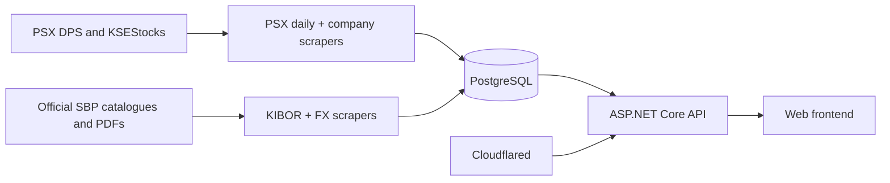

# WebICTCapital platform contract

Canonical database, ingestion, API, frontend, operations, and data-quality
contract for the WebICTCapital PSX/SBP platform.

| Item | Contract |
|---|---|
| Document revision | `2026-07-25` |
| Repository target filename | `schema.md` at the shared project/repository root |
| Production schema state | Post-migration `006_psx_company_cleanup.sql` |
| Evidence window | Operational evidence through `2026-07-25`; market-data quality counts through `2026-07-24` |
| Database | PostgreSQL 14 or newer |
| Database schema | `public` |
| Business timezone | `Asia/Karachi` |
| Date/time exchange | ISO 8601; PostgreSQL `date` for logical dates and `timestamptz` for instants |
| Frontend access | Through the API only; never connect the browser directly to PostgreSQL |
| Schema changes | Forward-only SQL migrations for existing databases; the complete DDL below is for a fresh database |
| Raw-data policy | Preserve source observations and gaps; never silently repair, average, interpolate, clamp, swap, or forward-fill them |

## Document status labels

| Label | Meaning |
|---|---|
| **Implemented** | Present in the reviewed code and covered by tests |
| **Production-verified** | Observed against production logs or read-only validation queries |
| **Known deviation** | Deployed behavior or source data does not yet meet the intended contract |
| **Reviewed source anomaly** | Exact source defect is fingerprinted and intentionally produces no invented fact |
| **Planned** | Design direction only; not part of the current production schema or API |

## Executive production status

| Surface | Status on 2026-07-25 | Operational conclusion |
|---|---|---|
| PSX daily pipeline | **Implemented and production-verified** | Merge-first imports, provider-scoped pruning, conditional timestamps, incremental technical calculation, advisory locks, and graceful shutdown are working. Keep the schedule enabled. |
| Raw technicals | **Production-verified with a modeling caveat** | `540,184` eligible positive-close quote rows had `0` missing and `0` stale raw `ta_raw_v1` rows. OHLC-quality limitations affecting ATR are documented below. |
| PSX company importer | **Implemented; production-capable with known deviations** | The full manual run completed without unfinished runs or ticker failures. Source omissions are safely rejected, but delisted-name classification and a small set of optional-source policies still need follow-up. |
| KIBOR importer | **Implemented and production-verified** | The ordinary backlog is caught up. Ten exact catalogue aliases/source defects are reviewed terminal outcomes; no values are fabricated. |
| SBP FX importer | **Implemented and production-verified** | Valid publications load, newest work is prioritized, and seven known catalogue/document mismatches are rejected with audit evidence. |
| ASP.NET Core API | **Implemented** | Ticker detail/comparison, persisted technicals, KIBOR, and canonical USD/PKR use read-only database access and canonical relations. |
| Frontend | **Partially implemented** | Markets workspace routes consume API DTOs for market overview, stocks explorer, ticker detail/comparison, KIBOR, and USD/PKR. Portfolio market enrichment still has legacy Supabase market reads. |
| Portfolio/OAuth | **Planned** | No user, OAuth, holding, transaction, or portfolio schema is part of this document yet. |
| Research ranking/backtesting | **Planned; not deployed** | Phase-one architecture exists separately. No research proposal migration or production-write path is authorized by this contract. |

The platform is suitable for production display and ordinary analytics when
consumers honor the quality flags and exclusions in this document. It is not
yet safe to treat every raw OHLC row as a clean modeling bar, and historical
index gaps must remain gaps until an authorized source supplies the missing
observations.

### Non-negotiable rules

- Never invent or average a missing raw market, KIBOR, or FX observation.
- Never overwrite an observed source fact with a derived estimate.
- Never blend distinct FX `rate_type` or `tenor` series.
- Never represent `daily_quote.turnover` as PKR traded value; it is share
  quantity. `close * turnover` is only an explicitly labeled estimate.
- Never treat raw prices or `ta_raw_v1` as corporate-action adjusted.
- Never use a current security universe to construct a historical research
  universe.
- Never expose PostgreSQL, credentials, scraper notes, or internal hashes to the
  browser.
- Never rerun migration 006 or apply an unreviewed research proposal migration
  to production.

## Purpose and authority

This file is the cross-service source of truth for:

- table, view, key, relationship, and data-type semantics;
- which scraper owns each write surface;
- scheduling and dependency order;
- API read models and frontend consumption rules;
- idempotency, history, freshness, and recovery behavior; and
- the complete schema expected by a fresh installation.

It is documentation, not a migration runner. On an existing production
database, apply the numbered migrations in order. Do **not** paste the complete
DDL section over an existing database.

Authority is applied in this order:

1. the actual production DDL, validated keys, and validated constraints;
2. explicit **known deviation** and **reviewed source anomaly** entries in this
   file;
3. service ownership, persistence, and API contracts in this file;
4. scraper/API implementation and tests; and
5. examples, setup notes, UI assumptions, or older pasted documentation.

When this file, production DDL, a scraper, and an API DTO disagree, stop the
deployment and resolve the mismatch. Do not silently coerce one source into
another semantic shape. Update this document in the same change that alters a
cross-service contract.

Volatile counts are labeled with an observation date and are evidence, not
constraints. Immutable migration outcomes and exact reviewed-source
fingerprints are historical audit facts.

## System topology



The PostgreSQL service is the durable system of record. Scraper containers are
workers invoked by Dokploy schedules. The ASP.NET Core API is the only supported
application read boundary, and Cloudflared exposes that API without exposing
PostgreSQL.

### Trust boundaries and source governance

| Boundary | Rule |
|---|---|
| Upstream → scraper | Treat every response as untrusted input. Validate HTTP status, content type/magic, identity, logical date, dataset family, value shape, completeness, and finite numerics before persistence. |
| Scraper → PostgreSQL | Use parameterized SQL, explicit transactions, idempotent natural keys, conditional updates, and structured `scrape_run` audit records. |
| PostgreSQL → API | Use a shared connection pool, read-only transactions for composed reads, parameterized inclusive ranges, and canonical views/tables only. |
| API → frontend | Return stable DTOs with source semantics and nulls intact. Do not leak storage credentials, internal hashes, locks, or raw operational notes. |
| Analytics/research | Read from a separately permissioned read-only role. No model experiment may write through a source-reader credential. |

Approved production sources are the official PSX/DPS pages and publications,
the currently configured KSEStocks historical index route, and official SBP
catalogues/PDFs. A secondary source may be considered only after provenance,
date alignment, field semantics, redistribution rights, and regression fixtures
are reviewed.

Sarmaaya/Surmaaya and SCS Trade are **not approved production backfill
sources** under this contract. Publicly reachable data is not the same as
licensed reusable data. Sarmaaya terms observed during review restrict
automated/competing use, and its available volume-only surface cannot repair
OHLC index gaps. SCS Trade remains an unverified secondary source. Do not add
either to a scraper, copy historical values, or use them to overwrite canonical
facts without written authorization and a source-specific implementation
review.

Commercial redistribution of upstream PSX/SBP/KSEStocks data must receive a
separate product/legal licensing review. This document defines technical
lineage; it does not grant data rights.

## Runtime services and schedules

All cron expressions below are interpreted in `Asia/Karachi`. Dokploy runs the
command inside the already-deployed service container. Containers remain idle
between jobs; internal Python schedulers must remain disabled.

| Order | Dokploy service | Command | Cron | Local schedule | Purpose |
|---:|---|---|---|---|---|
| 1 | `PsxSummaryScraper` | `/usr/local/bin/python -u /app/pipeline_runner.py` | `30 17 * * 1-5` | 17:30 Mon–Fri | Non-overlapping daily import followed by incremental raw-price technical calculation after committed success or partial work |
| 2 | `KiborScraper` | `/usr/local/bin/python -u /app/sbp_kibor.py` | `10 18 * * 1-5` | 18:10 Mon–Fri | Official SBP KIBOR publications |
| 3 | `SbpFxRates` | `/usr/local/bin/python -u /app/sbp_fx_rates.py --max-publications 100` | `40 18 * * 1-5` | 18:40 Mon–Fri | Official SBP FX publications and normalized observations |
| 4 | `TickerScraper` | `/usr/local/bin/python -u /app/psx_scraper.py --all-securities --no-json` | `20 19 * * 1,3,5` | 19:20 Mon/Wed/Fri | Company profiles, equity, valuation, fundamentals, ratios, announcements, payouts, and reports |

Deployment evidence on 2026-07-25 confirmed the PSX daily schedule. The company
importer was validated by a completed manual full run; recurring schedule
enablement was not confirmed in the captured evidence. Before enabling it,
verify the deployed image contains the post-006 importer, migration 006 is
present, no `psx_company` run is still `running`, and the classification
deviation below is accepted or fixed. KIBOR and FX schedule outcomes showed
successful handling of their reviewed anomalies.

The gaps reduce load on the database and upstream sites. They are operational
spacing, not a correctness mechanism: every importer must remain transactionally
safe and idempotent if jobs overlap or are retried. A job should fail fast when
its own advisory lock cannot be acquired; the PSX daily and company importers
must use distinct locks.

The always-on services are PostgreSQL, the ASP.NET Core API, and Cloudflared.
They do not belong in the scraper schedule.

`pipeline_runner.py` is the scheduled one-shot entrypoint. It holds a distinct
session advisory lock across both child processes. It runs
`compute_technicals.py` after a committed successful or partial daily import,
including a synchronized import with zero fact writes. It preserves retryable
or fatal component results and does not launch a follow-up step after fatal
import failure, confirmed importer-lock contention, or shutdown.
`compute_technicals.py` remains available on demand with `--full`,
`--symbol SYMBOL`, or `--dry-run`; do not schedule it separately from the daily
pipeline.

Scheduler-facing exit statuses are 0 for success, synchronized/no changes,
authoritative no-data, or a pipeline-lock collision where another complete
pipeline owns the work; 1 for committed partial/retryable work; 2 for fatal
failure; and `128 + signal` for shutdown. Internal exit 3 is reserved for an
importer or calculator advisory-lock collision. A child importer-lock collision
maps to scheduler status 1 because it does not prove that a complete pipeline
owns the work. A busy technical lock after a committed import maps to scheduler
status 1 unless coverage of the newly committed quote watermark can be proven.
Selecting zero affected securities is a successful idempotent technical run.

### Implementation map

| Service | Core implementation | Tests/documentation that must move with it |
|---|---|---|
| PSX daily pipeline | `parse_psx.py`, `compute_technicals.py`, `pipeline_runner.py`, `container_idle.py`, service `Dockerfile` | PostgreSQL merge/prune tests, anomaly tests, scheduler/lock tests, technical watermark tests, PID-1 tests, `Setup.md`, this contract |
| PSX company importer | `psx_scraper.py`, `psx_company_transform.py`, `psx_company_db.py`, `container_idle.py`, service `Dockerfile` | Transform/persistence/regression/migration tests, source fixtures, this contract |
| KIBOR importer | `sbp_kibor.py`, service `Dockerfile` | Exact-PDF fixtures/hashes, alias/anomaly tests, this contract |
| SBP FX importer | `sbp_fx_rates.py`, service `Dockerfile` | Publication-family/date/parser fixtures and tests, this contract |
| ASP.NET Core API | Controllers, query-option/DTO models, validators, services, repositories, `Program.cs` DI | Unit tests, disposable-PostgreSQL repository tests, OpenAPI, this contract |
| Frontend | Framework-specific API client, routes, charts, tables, auth/portfolio modules when added | DTO contract tests, date/null/decimal rendering tests, accessibility and E2E tests |

Production workers run as UID/GID 10001. Their idle container PID 1 forwards
SIGTERM to active `docker exec` work and waits for graceful transaction
finalization. Images compile/import their entrypoints at build time.

`DATABASE_URL` is the preferred writer connection variable;
`DatabaseURL` remains a documented compatibility alias where implemented.
Tests that rebuild schemas use `TEST_DATABASE_URL` and must point only to a
disposable database. Research prototypes use `DATABASE_URL_READONLY`; they must
fail if it is missing and must never fall back to production writer credentials.

## Ownership and source mapping

### PSX daily market importer

`parse_psx.py` owns the daily market facts.

| Data | Authoritative source | Write surface |
|---|---|---|
| Listed symbols and company names | PSX DPS closing-rate publication | `security` |
| Ticker OHLC, change, section, and turnover | PSX DPS closing-rate PDF | `daily_quote` |
| Whole-market volume and breadth | PSX DPS closing-rate PDF | `market_summary` |
| Current/latest KSE index snapshot | PSX DPS live index panels | `market_index`, `index_daily` |
| Historical KSE index snapshot | KSEStocks Market Summary | `market_index`, `index_daily` |
| Latest complete trading-day narrative | Configured LLM, using imported market facts | `market_ai_summaries` |

KSE index values must **never** be parsed from the closing-rate PDF. The PDF is
authoritative only for ticker rows and market-wide summary fields. The current
day routes to PSX DPS index panels; a historical day routes to KSEStocks.
Those routes are separate ownership scopes, not interchangeable global
snapshots. `dps_index` explicitly manages `KSE100`, `KSE100PR`, `ALLSHR`,
`KSE30`, `KMI30`, and `KMIALLSHR`. `ksestocks_index` explicitly manages
`KSE100`, `ALLSHR`, `KSE30`, `KMI30`, and `KMIALLSHR`; KSEStocks has no
`KSE100PR` contract. Optional codes outside the active route and rows owned by
another or unrelated source remain untouched.

Backfill completeness is determined from required rows for each candidate date,
not from `MAX(trade_date)` alone. A newer row must not hide an older hole. Each
date commits atomically, so a stopped run resumes from remaining incomplete
dates. A network or parsing failure is retryable and must not be recorded as a
holiday. The AI summary is skipped during historical backfill and is generated
only for the latest complete trading date.

The daily importer plans closing-rate and index repair independently. If the
stored closing component is already complete and only indexes are incomplete,
it does not refetch or rewrite the quotes or market summary. HTTP, parsing,
required-row completeness, and persistence failures remain actionable and
visible. A prior partial audit caused only by a reviewed optional index notice
can be finalized from independently validated complete database facts without
repeated source churn.

One exact required-index exception is reviewed and terminal. For `ALLSHR` on
2026-07-21, both DPS and KSEStocks published open 106995.80, high 107857.74,
low 106600.00, close 106568.82, change 149.03, change percent 0.14, volume
1000730920, and previous close 106419.79. Because the close is 31.18 points
below the published low, the observation remains invalid and is intentionally
absent from `index_daily`; no value is inferred, clamped, swapped, or replaced
with `KSE100PR`. Only that date, canonical `ALLSHR` code, reviewed provider,
and exact canonical numeric payload match fingerprint
`47b725f9da779b604cb5f0acad82055616bcdde72e5f5a70303ea07c39a04dc7`.
The successful `psx_daily_import` audit records the provider, values, reason,
classification, resolution, and fingerprint in `scrape_run.notes`. That exact
validated note resolves the required index component with a reviewed gap, so
the date is not automatically retried. Any changed payload is validated under
the ordinary strict rules and can either insert a corrected row or remain
retryable. Operators can explicitly recheck the source with
`parse_psx.py --recheck-reviewed-anomalies 2026-07-21`; complete closing facts
are reused while the index component is fetched again.
The reviewed gap resolves only the exact missing provider observation and does
not expand its prune scope. It cannot delete a valid row owned by another
provider, including a DPS `ALLSHR`, and `KSE100PR` remains a distinct optional
DPS fact.

The narrow recovery command
`parse_psx.py --repair-dps-kse100pr 2026-07-21` fetches the official DPS panel,
requires the panel `as_of` date to match, validates the observation normally,
and conditionally merges only `KSE100PR` without pruning. The audited official
payload is previous close 53642.22, high 54387.03, low 53683.37, close
53704.98, volume 448767016, change 62.76, change percent 0.12, and `as_of`
2026-07-21 15:50 Asia/Karachi. DPS supplied no open in that panel, so the stored
open remains null; the importer does not infer one. If the live panel has moved
to another date, recovery fails rather than assigning newer values to the old
date.
Since the DPS historical search does not return index rows, the separate
review-only fallback `recovery/restore_dps_kse100pr_2026-07-21.sql` uses those
same audited official values. It is guarded, transactional, conditionally
idempotent, advisory-locked, and audited in `scrape_run`; it is an operational
recovery artifact and not a migration.

Incoming quote and index snapshots are normalized and deduplicated before any
write. Rows are merged in place first. Their `inserted_at` is preserved, and
their `updated_at` changes only when the row-wise material payload is distinct.
Only a validated complete, nonempty, at-least-threshold component may then
prune same-date natural keys absent from its incoming ID set. Index pruning is
further restricted to existing rows whose `source_id` and canonical code both
belong to the explicit active provider contract. Partial, empty, undersized,
mixed-provider, missing-contract, or otherwise ambiguous snapshots never
prune. Each index prune is audited with canonical code, previous source code,
and reason. A genuine complete-snapshot
omission deletes only that absent quote or index; quote foreign-key cascades
therefore affect only the omitted quote's dependent valuation and technical
rows. An identical complete rerun performs zero fact writes and preserves all
quote children and timestamps.

#### Production evidence and remaining daily-market gaps

Read-only production checks through 2026-07-24 found:

| Check | Observed result | Interpretation |
|---|---:|---|
| Eligible positive-close quotes | `540,184` | Input population for raw technical coverage |
| Missing raw `ta_raw_v1` rows | `0` | Incremental recovery is complete at the observation time |
| Stale source watermarks/versions | `0` | Technical rows match quote `updated_at` and current version |
| Duplicate `daily_quote` keys | `0` | Natural key is clean |
| Non-finite quote numerics in the audit | `0` | No NaN/Infinity values were found |
| Negative turnover | `0` | Quantity domain is clean under the audit |
| Valuations without the exact quote | `0` | Exact-date foreign-key contract holds |
| Misattributed valuation dates | `0` | Post-006 repair remains effective |
| Duplicate `index_daily` keys | `0` | Natural key is clean |
| Index high/low, open/close, percentage, or previous-close violations | `0` | Excluding the exact reviewed ALLSHR gap, stored index rows passed the audit |

The raw closing publication nevertheless contains source-quality OHLC
anomalies. The audit found `18,024` rows where close did not lie inside the
stored high/low interval and `245` rows where open did not lie inside it.
Follow-up diagnostics isolated `4,355` eligible positive-close rows with
non-positive range inputs relevant to high/low-dependent calculations. Many
examples are inactive, special, GEM, non-voting, preference, or extremely
illiquid instruments with zero open/high/low and a positive close. These are
source facts, not duplicate-key or persistence corruption.

The canonical response is:

- preserve the raw row and its source provenance;
- never replace zero/missing OHLC fields with close, an average, a previous
  value, or another provider's value;
- permit close-only charts/indicators only when their own inputs are valid and
  the UI labels the series as raw;
- exclude invalid high/low rows from OHLC-dependent research features;
- expose future quality flags or an analytical eligibility view rather than
  changing the raw table; and
- keep any chart-only continuity series derived, labeled, and out of raw
  persistence, API defaults, model training, and backtest execution.

Historical required-index coverage is good but incomplete:

| Canonical index | Market sessions | Stored observations | Missing observations | Range observed |
|---|---:|---:|---:|---|
| `ALLSHR` | 1,375 | 1,331 | 44 | 2021-01-01 through 2026-07-24 |
| `KMI30` | 1,375 | 1,353 | 22 | 2021-01-01 through 2026-07-24 |
| `KMIALLSHR` | 1,375 | 1,328 | 47 | 2021-01-01 through 2026-07-24 |
| `KSE100` | 1,375 | 1,349 | 26 | 2021-01-01 through 2026-07-24 |
| `KSE30` | 1,375 | 1,351 | 24 | 2021-01-01 through 2026-07-24 |

That is 6,712 stored observations out of 6,875 expected index/session pairs
(`97.63%`) and 163 genuine gaps. Do not interpolate these raw index series. A
backfill must use an authorized source, validate the exact trade date and
canonical index identity, insert only missing/corrected facts, preserve
provider provenance, and record an audit. Research comparisons must either use
the common complete-date intersection or fail/document the incomplete window.

### Technical-indicator calculator

`compute_technicals.py` is the sole writer of `technical_indicator_daily`.
`parse_psx.py` remains the owner of `daily_quote`; the calculator reads that
table and `security` but must never update, delete, or otherwise repair either
source table. It makes no external HTTP requests and produces no JSON files.

The calculator stores only `price_basis = 'raw'`. The schema permits an
`adjusted` basis for a future, separately specified pipeline, but no adjusted
prices currently exist and consumers must not interpret raw indicators as
split- or dividend-adjusted. `calculation_version` is calculation metadata, not
part of the primary key: recalculating a security with a new version replaces
the row for the same security, date, and price basis.

The worker validates its source and destination columns, then holds the
session-level PostgreSQL advisory lock named `psx_technical_indicators` for the
run. Each security is a separate transaction. Thus an interrupted or partially
failed run preserves completed securities and safely rediscovers unfinished
ones on its next invocation. If execution is interrupted during an active
security, that transaction is explicitly rolled back before the advisory lock
is released, so the unlock commit cannot commit partial indicator work.

Initial and recovery behavior:

- when `technical_indicator_daily` is empty, every security with quote history
  is processed from its first quote through its latest quote;
- otherwise, a security is affected when an eligible positive-close quote has
  no raw technical row, its `daily_quote.updated_at` is distinct from the
  matching `technical_indicator_daily.source_updated_at`, or the stored
  calculation version is not current. A security is also affected when an
  existing raw technical row's source close becomes null, non-positive, or
  non-finite;
- `--full` explicitly selects all quote histories and `--symbol MEBL` explicitly
  selects one complete history; `--dry-run` calculates and reports without
  writing or deleting;
- every affected security is recalculated from complete quote history, not from
  a short lookback, so a historical correction repairs all later recursive
  EMA, RSI, MACD, and ATR values; and
- conditional UPSERTs use `IS DISTINCT FROM`, so an identical rerun is a no-op
  and preserves `calculated_at`. After recalculation, every raw row whose date
  is absent from the exact eligible-date set is removed, including rows whose
  source quote still exists but has become null, non-positive, or non-finite.
  Cleanup never touches future adjusted-basis rows and is not restricted by
  calculation version.

Only actual trading observations participate. Rows with a null, non-finite, or
non-positive close are skipped, and calendar/weekend rows are never generated.
Close drives price indicators; `turnover` drives the volume indicator.
These recovery and transaction-safety corrections require no database migration.

`ta_raw_v1` is immutable, but it was designed around positive-close
eligibility. It can therefore produce a finite ATR from a raw row whose
high/low inputs are zero or otherwise semantically unusable. This is a known
modeling limitation, not permission to rewrite history. Close-only
`ta_raw_v1` fields remain usable under their stated raw basis; ATR and any
future range-dependent feature must be filtered by explicit OHLC-quality rules
in research.

If the product needs quality-aware persisted indicators, specify a new feature
version such as `ta_raw_v2`, define its eligibility and warm-up behavior in a
reviewed migration/API plan, backfill it separately, and keep `ta_raw_v1`
reproducible. Do not silently change the existing formulas or reinterpret
already stored values.

### PSX company importer

`psx_scraper.py`, `psx_company_transform.py`, and `psx_company_db.py` form one
logical importer. `security` is the shared issuer dimension; the daily importer
defines its universe and the company importer may only enrich a nonblank company
name.

| Component | Write surface | Persistence rule |
|---|---|---|
| Profile | `company_profile_version` | SCD2, one current version per security |
| Shares/free float | `equity_profile_version` | SCD2; market cap is deliberately excluded |
| Market capitalization | `daily_valuation` | Daily fact only when the same security has an exact Karachi run-date quote |
| Statements | `financial_statement` | SCD2 by security, fiscal year, and period |
| Ratios | `financial_ratio` | SCD2 by security and fiscal year |
| Announcements | `announcement` | Append/correct by issuer-scoped document ID, otherwise content hash |
| Payouts/results | `company_payout` | Append/correct by stable event hash |
| Financial-report files | `financial_report_document` | Append/correct by issuer-scoped document ID, otherwise content hash |

Each ticker is one transaction. A failed ticker rolls back without undoing
previous successful tickers in the same run. Missing or regressed optional data
must not replace a complete current SCD2 row. Re-importing identical content is
a no-op.

The transform and persistence layers distinguish `persistable` from `complete`.
`persistable` means every field that would be stored is semantically valid;
false means no version may be inserted, even on an empty database. `complete`
means a valid component is sufficiently complete to supersede a current SCD2
row. Shares and free-float shares are nonnegative, free-float percent is in
`[0,100]`, and positive free-float shares may not exceed shares. Zero,
malformed, missing, NaN, and Infinity source values are never used to infer a
replacement field. A rejected equity component does not reject a separately
valid market cap, but that valuation still requires the exact run-date quote.

Duplicate statement periods and ratio years are compared by canonical payload.
Identical duplicates collapse to one record. Conflicting duplicates make the
entire natural key ambiguous, so all occurrences of that period/year are
omitted with an actionable warning. No source-order winner is selected.

A reversed book-closure range is accepted only when genuinely distinct source
columns explicitly label start/from and end/to and therefore prove a parser
column reversal. A shared range header is not independent evidence: its
reversed event is omitted and the warning retains the exact raw source range.

For `--all-securities`, the importer uses the latest observed
`daily_quote.section`, exact reviewed aliases, and fetched page/company-name
evidence. ETF identities, rights (including names ending `(R)`, `(R1)`, etc.),
preference and non-voting instruments, debt, warrants, derivatives, names
marked `DELISTED`/`XDDELISTED`, and obsolete names marked `CHANGED` are neutral
per-ticker `not_applicable` outcomes. Symbol suffix guessing alone must never
exclude an ordinary issuer. The canonical fetched company-page ticker must
equal the requested ticker before persistence. Classification never deletes
`security` or `daily_quote` history; retaining historical prices avoids
survivorship bias.

The importer holds one session advisory lock and commits each ticker
independently. After each ticker it checkpoints `rows_written`, completed and
per-outcome counts, the last completed ticker, and sanitized bounded outcome
details in `scrape_run.notes`. Once a process acquires the lock, it finalizes
older still-`running` `psx_company` rows as failed/interrupted before creating a
new run; a live lock owner cannot be marked stale. Normal exceptions and
SIGTERM are finalized where possible. SIGKILL cannot be handled, so the latest
checkpoint is the audit trail. A rerun always re-evaluates selected tickers and
relies on idempotency rather than unsafe cursor skipping.

#### Production evidence and company-source follow-up

The completed manual full run `scrape_run.id = 8089` reported:

| Requested | Success | Partial | Failed | Not applicable | Domain writes | Unfinished runs |
|---:|---:|---:|---:|---:|---:|---:|
| 649 | 522 | 41 | 0 | 86 | 461 | 0 |

`partial` here means at least one component was safely omitted while other
valid components could commit; it does not imply that a corrupt value was
stored. The 66 captured warnings classify as:

| Category | Warnings | Current handling | Follow-up |
|---|---:|---|---|
| Empty ratio years | 38 | Year omitted; no empty JSON fact stored | Treat as expected source omission unless a previously valid current year regresses |
| Invalid equity values | 12 | Whole equity component rejected | Keep strict validation; improve deterministic classification/review policy |
| Missing optional titles | 8 | Invalid optional event/report item omitted | Retain warning; inspect only if source layout changes broadly |
| Reversed payout ranges | 2 | Event omitted with raw range in warning | Keep; never swap without independent labeled columns |
| Unsupported `Q5`/`Q6` periods | 2 | Statement omitted | Investigate DSML source semantics before adding a new canonical period |
| Missing company profiles | 2 | Component omitted | Review `MODAMR` and `PKGIR` identity/applicability |
| Non-finite PEG | 1 | Invalid value rejected | Keep strict finite-number policy |
| Financial-report HTTP 404 | 1 | Component remains partial/actionable | Decide whether OLPL is authoritative no-data or a genuine route failure |

There is one **known implementation deviation**: ADOS, BCML, and WYETH were
still parsed as partial invalid-equity issuers even though the fetched official
names include `DELISTED` or `XDDELISTED`. Their contradictory equity values
were correctly rejected, and migration 006 already removed the prior bad
versions, so this is not current database corruption. The recurring importer
should classify explicit delisted/changed page identities before component
parsing and return neutral `not_applicable`. Add fixtures proving this ordering;
do not delete their historical `security` or `daily_quote` rows.

PACE is different: the reviewed official source itself reported shares
`309,862,893`, free-float shares `405,019,097`, and free-float percentage
`130.71`. Rejection is correct. If repeated unchanged, it may be promoted to an
exact fingerprinted reviewed source anomaly to reduce alert noise, but the
constraint must not be weakened and no corrected value may be inferred.

The remaining DSML, MODAMR, PKGIR, and OLPL cases are product/source-policy
work, not reasons to disable safe persistence globally. Keep warnings
observable, use targeted fixtures, and change a status to terminal/no-data only
after authoritative evidence is documented.

This importer does not write `daily_quote`, `market_summary`, `market_index`,
`index_daily`, `kibor_rate`, `fx_publication`, or `fx_rate_observation`.

### SBP KIBOR importer

`sbp_kibor.py` reads the official SBP publication catalogue and PDFs. It owns
`kibor_rate` and uses the `kibor` data-source code. The supported source tenors
are `1W`, `2W`, `1M`, `3M`, `6M`, `9M`, and `1Y`; each observation contains a
bid and offer for its publication date.

Backfill candidates come from the official catalogue. Therefore weekends and
holidays without a publication are not missing rows. A transient download or
parse failure remains retryable. An identical re-import must not alter values or
their `updated_at` timestamp.

The importer processes newest unresolved publications before historical
exceptions. It validates PDF magic, minimum size, SHA-256, terminal xref/EOF,
document identity, declared date, seven-tenor completeness, and bid/offer
ordering. Catalogue date, URL, document date, size, hash, parser outcome, and
review resolution belong in `scrape_run.notes`.

The following exact official entries are reviewed:

| Catalogue entry | Resolution | Persisted-fact behavior |
|---|---|---|
| 2021-01-09 | Byte-identical Saturday alias of the 2021-01-11 PDF | Use canonical document date only; never duplicate Saturday facts |
| 2021-02-20 | Byte-identical Saturday alias of the 2021-02-22 PDF | Use canonical document date only |
| 2023-07-15 | Byte-identical Saturday alias of the 2023-07-17 PDF | Use canonical document date only |
| 2021-09-06 | Official 2W row has bid 7.94 and offer 7.44 | Reviewed source anomaly; no swapped or invented row |
| 2022-05-20 | Official 6M offer token is malformed as `14..87` | Reviewed source anomaly; no invented 6M fact |
| 2023-07-26 | Official file is truncated and lacks a valid terminal xref/EOF | Reviewed source anomaly; no facts |
| 2025-07-24 | Official file is truncated and lacks a valid terminal xref/EOF | Reviewed source anomaly; no facts |
| 2025-07-31 | Official 2W row has bid 11.84 and offer 11.34 | Reviewed source anomaly; no swapped or invented row |
| 2025-08-01 | Official file is truncated and lacks a valid terminal xref/EOF | Reviewed source anomaly; no facts |
| 2026-05-19 | Catalogue attachment is an FX Mark-to-Market document, not KIBOR | Reviewed dataset mismatch; no KIBOR facts |

Each exception is SHA-pinned. A changed document bypasses the old resolution
and receives full validation. Alias resolution verifies all seven canonical
facts transactionally and inserts them under the document date only if absent.
The production run observed `1,343` catalogue entries, `1,333` complete dates,
`10` reviewed entries, `0` unhandled pending entries, and exit success.

### SBP FX importer

`sbp_fx_rates.py` reads official SBP catalogue entries and PDFs and uses the
`fx` data-source code. It owns `fx_publication` and `fx_rate_observation`.

One publication row records the source document and its logical dates. Its child
observations retain currency pair, tenor, and value shape. Four publication
families are intentionally distinct:

- `conversion`
- `open_market`
- `weighted_average_customer`
- `mark_to_market`

Consumers must retain both `rate_type` and `tenor`; rates with different
semantics must never be blended into one series. A row contains either a single
positive `rate` or a positive ordered `bid`/`offer` pair, never both.

`v_sbp_fx_rates` is the full normalized query surface. For the platform's main
USD/PKR chart and PSX correlation, use `v_usdpkr_m2m_ready`, which selects only
Mark-to-Market USD/PKR `ready` observations. The older generic `fx_rate` table is
reserved for a future market-feed OHLC importer and is not populated by the SBP
PDF scraper.

As with KIBOR, publication discovery is catalogue-driven. A missing catalogue
entry is not synthesized, and a failed download is not treated as a holiday.

The FX importer processes current/new publications before the historical
backlog. Before parsing values it extracts label-aware document dates and
classifies the document family from its title/table layout. Catalogue family,
catalogue date, declared family, declared date, URL, file metadata, and failure
stage are retained in structured audit notes. Download/parsing problems and
database persistence problems use distinct diagnostics.

Seven catalogue entries are exact reviewed mismatches:

| Catalogue key | Document actually served | Resolution |
|---|---|---|
| 2024-03-08 `conversion` | Mark-to-Market dated 2024-03-08 | Reject dataset mismatch |
| 2025-06-26 `open_market` | Open-market sheet declaring 2025-06-27 | Reject date mismatch |
| 2026-03-13 `open_market` | Open-market sheet declaring 2026-03-12 | Reject date mismatch |
| 2026-06-01 `mark_to_market` | Weighted-average customer sheet dated 2026-06-01 | Reject dataset mismatch |
| 2026-06-04 `mark_to_market` | Weighted-average customer sheet dated 2026-06-04 | Reject dataset mismatch |
| 2026-06-05 `mark_to_market` | Weighted-average customer sheet dated 2026-06-05 | Reject dataset mismatch |
| 2026-06-11 `mark_to_market` | Genuine M2M sheet declaring 2026-06-10 | Reject date mismatch; do not duplicate the canonical 2026-06-10 publication |

These resolve as reviewed terminal/no-data audit outcomes for the erroneous
catalogue keys, not as `fx_publication` rows. Any byte/content change triggers
ordinary validation. Valid current publications remain unaffected; the
2026-07-20 open-market publication was observed committing successfully.

## Provenance and source codes

Every importer registers or reuses a stable `data_source.code` and records
attempts in `scrape_run`. IDs are database-local surrogate keys; consumers use
the code.

| `data_source.code` | Owner / meaning |
|---|---|
| `psx_daily_import` | Orchestration/audit record for a PSX daily import |
| `psx_closing` | Official PSX closing-rate PDF facts |
| `dps_index` | Current PSX DPS index panels |
| `ksestocks_index` | Historical KSEStocks index summary |
| `psx_company` | PSX company pages and documents |
| `kibor` | Official SBP KIBOR publications |
| `fx` | Official SBP FX publications |
| `metals` | Reserved for a future metal-rate importer |

`scrape_run.status` has these meanings:

| Status | Meaning |
|---|---|
| `running` | Active lock-owning import; the next lock owner recovers an abandoned row as failed/interrupted |
| `success` | All requested components completed and committed |
| `partial` | Some components/tickers committed and warnings are recorded |
| `failed` | No valid completion for the requested unit of work |
| `no_data` | The authoritative catalogue/source confirms no applicable data; never use this for a transient error |

`rows_written` is an operational counter, not the final row count. The daily
importer counts only actual fact inserts, material updates, and validated
complete-snapshot prunes; no-op conflicts count as zero. Structured notes also
split these counts by `daily_quote`, `market_summary`, and `index_daily`. Use
fact-table queries to verify stored coverage.

`not_applicable` is never a `scrape_run.status`; it is a neutral per-ticker
outcome stored in the structured JSON text in `scrape_run.notes`. A run made up
only of success and `not_applicable` outcomes finishes `success` and exits zero.
Reviewed expected optional omissions are non-actionable notices. HTTP and page
identity failures, ambiguous duplicates, invalid numeric components, and
persistence failures remain actionable warnings/failures. Notes preserve every
sanitized warning detail and never include credentials.

A `reviewed_terminal_source_anomaly` note is non-actionable only when all
identity fields required by its source-specific policy match: provider,
catalogue/logical date, dataset or canonical code, document-declared date,
canonical values where extractable, and SHA-256 fingerprint. It records an
explicit resolution such as `resolved_with_reviewed_gap`,
`catalogue_alias`, or `source_anomaly`; it never manufactures a fact row. The
automatic planner revalidates the structured note before treating the natural
key as resolved. Any identity, payload, or hash change restores normal strict
validation. Resolution does not grant global snapshot authority, permit
cross-provider pruning, or relax a table constraint.

## Relational model and key semantics

### Stable dimensions and opaque IDs

`security.id`, `market_index.id`, publication IDs, and event IDs are surrogate
keys. Sequence values are expected to be sparse and non-contiguous because
PostgreSQL sequences are not rolled back and conflict attempts may consume
values. This is normal. APIs and frontend routes must identify securities by
`security.symbol` and indexes by `market_index.code`, never by display order or
the apparent size of an ID.

### Daily facts

Daily-series tables use a natural entity/date key and are safe to UPSERT:

| Table | Grain / key | Notes |
|---|---|---|
| `daily_quote` | one security per `trade_date` | Authoritative PSX ticker OHLC and turnover |
| `technical_indicator_daily` | one security, `trade_date`, and price basis | Derived raw-price indicators; current calculation version replaces the same basis row |
| `market_summary` | one `trade_date` | Market-wide breadth and volume |
| `index_daily` | one index per `trade_date` | Source is DPS or KSEStocks, never the PDF |
| `daily_valuation` | one security per `trade_date` | Full PKR market cap; company source value is multiplied by 1,000 |
| `kibor_rate` | one `quote_date` and tenor | Bid/offer point observation |
| `fx_rate` | one `quote_date`, `base_ccy`, and `quote_ccy` | Reserved generic spot/OHLC surface; this table has no tenor column |
| `metal_rate` | one date/metal/purity/unit | Reserved until a metal importer is deployed |

Trading and publication gaps are meaningful. APIs and charts must not fabricate
weekend or holiday observations and must not linearly interpolate raw series.
Any separately requested analytical estimate must live outside these tables,
be versioned/labeled as estimated, and remain excluded from raw exports and
default model/backtest inputs.

### Versioned facts (SCD2)

`company_profile_version`, `equity_profile_version`, `financial_statement`, and
`financial_ratio` use half-open validity intervals `[valid_from, valid_to)`.
Exactly one current row exists per natural key, enforced by partial unique
indexes.

| Import result | Required behavior |
|---|---|
| New persistable content | Insert a current row; invalid content is rejected even when no current row exists |
| Identical `content_hash` | No write |
| Incomplete/regressed payload | Preserve current row and report a warning |
| Same-day corrected content | Update the current row because date precision cannot represent two same-day versions |
| Later corrected content | Close the current interval and insert a new current row |
| Run date older than `valid_from` | Reject the change |

Current-value API reads filter `is_current = true`. Historical/restatement reads
return validity fields and order by `valid_from`; they must not infer versions
from `updated_at`.

### Event and document history

Announcements, payouts, and financial-report documents are not deleted merely
because a later source response omits them. Stable source identifiers permit
metadata correction while preserving `first_seen`. Content hashes provide the
fallback identity where no source identifier exists.

PSX document IDs are issuer-scoped. Unique keys therefore include
`security_id`; a global unique document-ID index is invalid for this schema.

### Timestamp meaning

| Field | Meaning |
|---|---|
| `inserted_at` / `first_seen` | First successful observation; preserve it during corrections |
| `updated_at` on conditional importers | Last material stored-value change |
| `valid_from` / `valid_to` | Business validity for SCD2 history |
| `generated_at` | AI-summary generation time |
| `source_updated_at` on a technical row | `daily_quote.updated_at` used by that calculation |
| `calculated_at` | First insert or most recent material indicator/version/source change; identical recalculation preserves it |
| `scrape_run.started_at` / `finished_at` | Operational run lifecycle |

The daily importer uses row-wise `IS DISTINCT FROM` predicates for
`daily_quote`, `market_summary`, and `index_daily`, and a material-change
predicate for `market_index`. An identical accepted rerun therefore preserves
every fact timestamp. A corrected quote changes `daily_quote.updated_at`; that
is the source watermark that selects the security for technical recalculation.

## Data-quality and missing-value contract

Missing, invalid, and reviewed-anomalous observations are different states and
must not collapse to zero:

| State | Raw persistence | API/UI behavior | Modeling behavior |
|---|---|---|---|
| Source did not publish | No fabricated row/value | Preserve the gap and explain the source/date where useful | Exclude or use an explicitly documented missingness feature |
| Source published null/blank optional field | Store null when the table permits it | Render unavailable; never render zero | Exclude the dependent feature or use a documented null policy |
| Source published contradictory required fields | Reject the component/fact and audit it | Do not serve an invented replacement | Exclude; investigate or fingerprint an exact terminal anomaly |
| Exact reviewed source anomaly | Keep the audited resolution; usually no fact row | Preserve the gap, optionally expose a non-sensitive quality notice | Exclude from raw benchmarks/features |
| Derived analytical estimate | Never overwrite the raw fact | Only expose through a separately named/labeled analytical DTO | Version the method and prevent leakage |

Three layers must remain separate:

1. **Observed layer** — the tables in this schema; source facts and meaningful
   gaps only.
2. **Analytical layer** — versioned quality filters, features, models, and
   backtests that may transform observed data without mutating it.
3. **Presentation layer** — chart formatting and optional visual continuity.
   Any visual-only estimate must be clearly labeled, switchable, and excluded
   from exported raw data and model inputs.

Do not average neighboring sessions to fill raw quotes, index values, KIBOR, FX,
fundamentals, or technical warm-up nulls. Averaging makes a plausible-looking
number but destroys provenance, volatility, returns, and backtest timing. If a
future product explicitly needs imputation, store the method/version and
confidence outside these raw tables and return `isEstimated = true`.

Suggested future additive quality surfaces are a row-level source-quality
observation table or views such as `v_daily_quote_model_eligible_v1`. They
should report reason codes (for example `nonpositive_high_low`,
`close_outside_range`, `missing_turnover`, `special_instrument`) without
altering `daily_quote`.

## API contract

The ASP.NET Core API owns connection pooling and database reads. It uses one
shared `NpgsqlDataSource`; repositories execute parameterized queries. `/health`
is a liveness endpoint and intentionally does not make deployment health depend
on a temporary database outage.

### Existing read surfaces

| Consumer use | API surface | Primary database read set |
|---|---|---|
| Latest daily market page | Existing market-summary controller route | `market_summary`, `daily_quote`, `market_ai_summaries`, `index_daily`, `market_index` |
| Single ticker | `GET /api/tickers/{symbol}` | Security, quotes, raw `technical_indicator_daily`, valuation, current/versioned company facts, and events |
| Two-ticker comparison | `GET /api/tickers/compare?symbols=MEBL&symbols=HBL` | Quotes, raw technicals, equity, statements, and ratios for exactly two symbols |
| KIBOR curve/history | `GET /api/rates/kibor` | `kibor_rate` bid/offer observations by publication `quote_date` and canonical tenor |
| Canonical USD/PKR | `GET /api/rates/usd-pkr` | `v_usdpkr_m2m_ready` point rates and publication metadata only |

The exact existing market-summary route remains defined by its controller; a
schema update must not rename it. Add the concrete route to API/OpenAPI docs
from the deployed controller rather than guessing it here.

Single-ticker query parameters:

| Parameter | Contract |
|---|---|
| `from`, `to` | Optional inclusive quote range; `from <= to`; maximum resolved span is 10 years |
| `include` | Comma-separated subset of `quotes,profile,equity,financials,ratios,announcements,payouts,reports,technicals`; omitted means all sections |
| `financialYears` | Integer from 1 through 20 |
| `eventLimit` | Integer from 1 through 100 for bounded event/document lists |
| `includeRestatements` | When true, include historical SCD2 versions with validity metadata |

Symbols are normalized to uppercase. Unknown symbols return HTTP 404; malformed
ranges, includes, limits, or comparisons return RFC-compatible `ProblemDetails`
with HTTP 400. Comparison requires exactly two distinct symbols and resolves a
shared quote range so chart points are comparable.

The single-ticker response exposes technicals as `priceBasis`,
`calculationVersion`, nullable `asOf`, and ascending `points`. Each point carries
`tradeDate` plus the persisted return, moving-average, RSI, MACD, ATR, Bollinger,
and volume-SMA decimal fields. The public contract is fixed to `raw` and
`ta_raw_v1`; clients cannot select another basis or version. `asOf` is the last
actual row inside the inclusive requested range. The API does not forward-fill
or search before `from`. A requested technical section with no matching rows is
an empty raw/`ta_raw_v1` series; an unrequested section is null. The comparison
response reuses the same series DTO for both securities and the existing shared
requested range.

### Technical-indicator API semantics

Technical indicators are a derived read surface, never a replacement for the
authoritative quote series. When an API endpoint exposes them, it must join by
`security_id` and `trade_date`, filter `price_basis = 'raw'` and
`calculation_version = 'ta_raw_v1'`, and return the basis and version in the DTO
or in unambiguous response metadata. APIs must not silently label raw values as
adjusted.

Indicator rows align to actual eligible trading observations. Warm-up values
are null rather than zero: returns require their stated lag, SMA/Bollinger and
volume SMA require complete windows, EMA requires its initialization period,
RSI requires 14 changes, ATR requires 14 true ranges, and MACD signal requires
nine available MACD values. Return and RSI fields are percentage values already
expressed on a 0–100 scale where applicable; consumers must not multiply them by
100 again. Missing turnover produces a null `volume_sma_20` until the rolling
20-observation window is complete again.

`ta_raw_v1` formulas are:

| Column | Exact formula / initialization |
|---|---|
| `return_1d_pct`, `return_5d_pct`, `return_20d_pct` | `((current close / close N trading observations earlier) - 1) * 100` |
| `sma_20`, `sma_50`, `sma_200` | Arithmetic mean of the last N closes; complete N-observation window only |
| `ema_12`, `ema_26` | Adjust-false recursion with `alpha = 2 / (N + 1)` and `EMA[0] = close[0]`; hidden until N observations exist |
| `macd` | `ema_12 - ema_26`; first available with `ema_26` |
| `macd_signal` | Adjust-false EMA(9) of available MACD values, initialized at the first MACD and hidden until nine MACD values exist |
| `macd_histogram` | `macd - macd_signal` |
| `rsi_14` | Wilder gain/loss means seeded from the first 14 close changes, then `(previous_average * 13 + current) / 14`; RSI is `100 - 100 / (1 + average_gain / average_loss)` |
| `atr_14` | True range is `max(high-low, abs(high-previous_close), abs(low-previous_close))`; first observation uses `high-low`. Wilder ATR is seeded by the first 14 true ranges, then `(previous_atr * 13 + current_true_range) / 14` |
| `bollinger_middle` | `sma_20` |
| `bollinger_upper`, `bollinger_lower` | `sma_20 +/- 2 * population_stddev(last 20 closes)`, with population divisor 20 (`ddof=0`) |
| `volume_sma_20` | Arithmetic mean of the last 20 `turnover` observations; all 20 must be present |

For RSI, zero average loss with positive average gain is 100, zero average gain
with positive average loss is 0, and a completely flat gain/loss window is 50.
All non-finite calculation results are persisted as null.

### Rates API contract

Rates endpoints use the existing schema without a migration. Repositories read
these canonical surfaces:

| Feature | Canonical read surface | Required filters/dimensions |
|---|---|---|
| KIBOR curve/history | `kibor_rate` | `quote_date`, `tenor`; return bid and offer separately |
| Main USD/PKR series | `v_usdpkr_m2m_ready` | Optional date range only |
| FX explorer | `v_sbp_fx_rates` | Preserve and expose `rate_type`, `tenor`, `base_ccy`, and `quote_ccy` |
| FX publication provenance | `fx_publication` joined to observations | Use when the client requests source document metadata |

Do not map SBP bid/offer data into OHLC fields, average a spread into a rate, or
combine rate families. API decimals must remain decimals; do not convert them
through binary floating point.

`GET /api/rates/kibor` accepts optional inclusive `from` and `to` date-only
parameters and an optional comma-separated `tenors` subset. Supported tenors are
case-insensitive on input and canonicalized to `1W, 2W, 1M, 3M, 6M, 9M, 1Y`.
Blank, unknown, or duplicate selections return HTTP 400 `ProblemDetails`.
`tenorOrder`, observations, and same-date curve values preserve that explicit
order. `latestCurve` uses one common latest `quoteDate` inside the resolved
range; it never takes a different latest row per tenor. Bid and offer remain
separate nullable decimals.

`GET /api/rates/usd-pkr` accepts optional inclusive `from` and `to` date-only
parameters. It reads exclusively from `v_usdpkr_m2m_ready` and always identifies
the response as pair `USD/PKR`, rate type `mark_to_market`, tenor `ready`, label
“SBP Mark-to-Market — Ready”, and unit “PKR per USD”. Each ascending point
contains `quoteDate`, decimal `rate`, nullable `effectiveDate`, and source
publication `updatedAt`. `asOf` is the final actual point inside the resolved
range. The endpoint must not query generic `fx_rate` or mix other rate types,
pairs, or mark-to-market tenors.

Both routes query their canonical source-wide minimum and maximum dates for
`availableRange`. An omitted `to` resolves to the database maximum, and an
omitted `from` resolves to one year before the resolved `to`. Ranges are
inclusive, must have `from <= to`, and cannot exceed ten years. A valid range
with no rows returns HTTP 200 with the resolved range, empty arrays, and null
`asOf`/`asOfDate`. An empty canonical source returns null available/requested
ranges and empty series when no explicit complete range can be resolved.
Neither endpoint forward-fills missing publication dates. Configuration and
database failures remain failures rather than empty successful responses.

### API consistency and performance

- Use `market_summary.trade_date` as the authoritative date for a complete daily
  market response, then query quotes, indexes, and a completed AI summary for
  that same date. Do not independently choose `MAX(trade_date)` from every table.
- The index snapshot returned with a market day must use that requested market
  date, not the globally latest index date.
- Join `daily_valuation` by both security and quote date.
- Default company reads to current SCD2 rows; expose restatements only when the
  request asks for them.
- Bound event results and date spans. Add pagination before exposing unbounded
  historical event collections.
- Use a repeatable-read transaction or an equivalent single-snapshot query when
  composing a response from several tables.
- Never return `DATABASE_URL`, scraper notes containing credentials, content
  hashes, or internal lock identifiers to public clients.

Public production paths are rooted at `https://api.webictcapital.com`. Keep
route definitions in controllers/OpenAPI; database documentation must not
invent a route. Add contract tests that compare deployed OpenAPI with the DTO
and query behavior described here, especially default date ranges, null
serialization, `include=technicals`, and comparison shared-range behavior.

### Database roles and secrets

- Connection strings come from environment variables or the deployment secret
  store. Never commit, print, return, paste into logs, or include them in
  `scrape_run.notes`.
- The public API should use a read-only role with `CONNECT`, `USAGE` on the
  intended schema, and `SELECT` only on required relations/views.
- Each scraper should eventually have a least-privilege writer role limited to
  its ownership surfaces and required shared dimensions/audit tables. Until
  split roles are deployed, ownership boundaries in this document still apply
  in code review.
- `webict_research_ro` was created with login/connection limits and database
  `CONNECT` during research exploration. No production `research` schema or
  research tables are defined by this contract, and no additional
  `USAGE`/`SELECT` grant should be assumed. Verify grants explicitly before use.
- `default_transaction_read_only`, `statement_timeout`, connection limit, and
  idle transaction timeout are defense-in-depth for research access, not a
  substitute for relation-level grants.
- OAuth secrets, user identities, portfolios, and broker credentials must live
  outside scraper configuration. No broker credential or execution permission
  belongs in the market-data database.

## Frontend contract

The frontend consumes API DTOs, not database rows. Database names in this table
explain lineage only.

| Screen/feature | API data needed | Display rules |
|---|---|---|
| Market overview | Latest market summary, same-date indexes/tickers, completed AI brief | Show the trade date and source freshness; omit a missing/failed AI brief without hiding market facts |
| Ticker detail | Quotes, raw technical indicators, as-of valuation, current profile/equity, fundamentals, ratios, announcements, payouts, reports | Route by uppercase symbol; show available and requested quote ranges; label indicators as raw and preserve warm-up nulls |
| Ticker comparison | Exactly two comparison items with quotes and raw technicals on one shared range | Align series by actual trade date; preserve gaps; label technical basis and fiscal period/year |
| KIBOR | `GET /api/rates/kibor` tenor-level bid/offer curve and history | Keep `1W, 2W, 1M, 3M, 6M, 9M, 1Y` order explicit; do not collapse bid and offer |
| USD/PKR | `GET /api/rates/usd-pkr` backed only by `v_usdpkr_m2m_ready` | Label “SBP Mark-to-Market — Ready”, unit “PKR per USD”; display quote/effective dates and source freshness |
| FX explorer | Full normalized FX surface through the API | Require/label rate type and tenor; render either a rate or bid/offer pair |

Frontend numeric rules:

- treat prices, ratios, rates, EPS, market capitalization, and percentages as
  decimal values; format only at presentation time;
- `market_cap` is full PKR, not thousands of PKR;
- `free_float_pct` is already a percentage value and must not be divided by 100;
- `turnover` and index `volume` are whole-number quantities;
- null means unavailable/not applicable, not zero; and
- date-only values must not shift under browser timezone conversion. Display
  logical dates as their ISO calendar date and render instants in
  `Asia/Karachi` unless the user explicitly selects another timezone.

Frontend behavior must distinguish loading, empty, partial/quality-notice, and
error states. An HTTP 200 empty series is not a zero series; a 400 validation
problem is not a 404 ticker; and an infrastructure failure must not be cached as
authoritative no-data. Charts plot only returned observations. They may visually
span normal non-session dates, but must not insert synthetic points or export
interpolated values. Tooltips and downloads retain the actual observation date.

Frontend implementation status on 2026-07-27:

- `/data`, `/data/stocks`, `/data/compare`, `/data/rates`, and `/stocks/:symbol`
  use `src/lib/api/*` and public `https://api.webictcapital.com` endpoints by
  default. `VITE_MARKET_API_BASE_URL` may override the public base URL.
- Confirmed route mapping is `GET /api/market-summary/latest/tickers`,
  `GET /api/tickers/{symbol}`, `GET /api/tickers/compare`,
  `GET /api/rates/kibor`, and `GET /api/rates/usd-pkr`.
- The market-summary listing DTO currently lacks date/range parameters,
  pagination, listing-level technical fields, richer sector taxonomy, and
  reliable non-null market-cap/P/E values. The frontend omits unsupported
  columns or renders unavailable states rather than deriving official facts.
- Browser access is blocked until the API deployment sends CORS headers for the
  frontend origin. On 2026-07-27, a GET with
  `Origin: http://127.0.0.1:5174` returned HTTP 200 JSON without
  `Access-Control-Allow-Origin`.
- Portfolio trades and watchlists remain Supabase-backed. Portfolio market
  enrichment still uses legacy Supabase market helpers and is the remaining
  public-market source-of-truth migration item.
- Supabase `user_trades` and `watchlists` must rely on RLS policies matching
  `auth.uid()` to `user_id`; frontend `requireUserId()` is only a UX guard.

Where an API later exposes quality metadata, the UI should show a concise
notice and allow users to inspect exclusions. It must not hide a rejected raw
fact by substituting an average. `ta_raw_v1` ATR should be described as raw and
quality-sensitive until a quality-aware version is deployed.

Portfolio and Google OAuth work is a separate bounded domain. The browser
should authenticate with an authorization-code flow with PKCE; the API, not the
frontend, enforces portfolio ownership. Holdings and transactions must use
immutable user-scoped IDs, decimal quantities/prices, currency, timestamps,
cost basis, and an audit trail. Do not bolt user data or OAuth tokens onto
`security`, quote, scraper, or research tables.

For cache validation, future API work may derive ETags or `Last-Modified` values
from a response-level version/freshness calculation. It must not blindly use one
table's `updated_at` for a response composed from multiple tables.

## Known issues and prioritized roadmap

| Priority | Work item | Why it matters | Safe next action |
|---|---|---|---|
| P0 | Keep scraper/API documentation synchronized with deployed commits and OpenAPI | This file is cross-service authority; drift causes unsafe fixes | Add a release checklist and CI links/checks for schema ownership, routes, and migration state |
| P0 | Review commercial source licensing/redistribution | Technical access does not prove product redistribution rights | Obtain written terms/permission before adding or expanding external sources |
| P1 | Fix company classification ordering for ADOS, BCML, and WYETH | Avoids noisy partial runs; existing bad equity is already removed | Classify explicit `DELISTED`/`XDDELISTED` identity before component parsing and add fixtures |
| P1 | Decide exact reviewed policy for PACE | Repeated deterministic bad equity creates alert noise | Fingerprint the exact source payload if stable; keep rejecting it and retain the constraint |
| P1 | Investigate DSML `Q5`/`Q6`, MODAMR/PKGIR profiles, and OLPL reports 404 | Clarifies source semantics without weakening validation | Capture official fixtures, classify each as supported, terminal no-data, or actionable |
| P1 | Add quote-quality flags/eligibility surface | 18,024 close-range anomalies and 4,355 non-positive range inputs can mislead OHLC models | Add an additive versioned quality view/table; do not mutate raw quotes |
| P1 | Define quality-aware indicator version | `ta_raw_v1` ATR can consume unusable raw high/low | Specify and backfill `ta_raw_v2` only after reviewed formula/API/migration design |
| P1 | Backfill 163 historical required-index gaps | Benchmark coverage is 97.63%, not complete | Use only an authorized exact-date source; preserve gaps until then |
| P1 | Verify canonical USD/PKR ready-series coverage after every FX catch-up | Catalogue completion does not by itself prove every required M2M-ready date is present | Record min/max/count from `v_usdpkr_m2m_ready`; keep it out of models whose required window is incomplete |
| P1 | Add API data-quality/freshness metadata | Frontend and research clients need explainable exclusions | Design backward-compatible DTO metadata and OpenAPI tests |
| P2 | Separate database roles per service | Limits blast radius | Create reviewed grants after inventorying each statement; test startup schema validation |
| P2 | Add observability/SLOs | Schedule success alone does not prove data completeness | Alert on stale latest dates, unfinished runs, partial streaks, missing/stale technicals, and source-anomaly drift |
| P2 | Portfolio + Google OAuth | User retention and personalized workflows | Design a separate user/portfolio migration, threat model, and privacy/retention policy |
| P2 | Research ranking/paper portfolios | Potential differentiated product, but high leakage/data-quality risk | Keep read-only, point-in-time, raw-basis, next-session, and paper-only until reviewed |

The research phase-one proposal is not part of production. Its proposed
migration filename used `006` inside a separate prototype, which now conflicts
with the applied production migration number. Do not execute it. If research
persistence is later approved, rebase it to the next production migration
number, review grants and retention, and require a distinct writer role.

### Planned research-only boundary

The approved design direction is a ranking and paper-backtesting service, not a
trading bot:

```text
Close[t] completed
  -> build point-in-time eligible universe and features
  -> publish research ranks after close
  -> attempt paper execution at Open[t+1]
  -> measure the explicitly configured future horizon
```

- Read prices only from `daily_quote` joined to `security`; use
  `technical_indicator_daily` only for raw `ta_raw_v1` and apply the quality
  caveats above.
- Build the universe independently for every historical date from information
  available then. Do not use today's symbols or index membership.
- KIBOR may be a feature. USD/PKR may come only from
  `v_usdpkr_m2m_ready` and is excluded whenever the required historical range
  is incomplete.
- Initial models exclude company profile, statements, ratios, and other
  fundamentals until historical publication availability is proven
  point-in-time.
- Features observed through close `t` cannot execute at close `t`; earliest
  simulated execution is the next global market session open.
- Model missing opens, suspensions, price/limit locks, participation capacity,
  partial fills, costs, and slippage. Never clamp observed returns to a presumed
  circuit-breaker percentage.
- Use purged/embargoed walk-forward selection and an untouched final test.
  Compare with KSE-100 on common dates, equal-weight eligible securities, and a
  simple momentum baseline.
- Report CAGR, volatility, Sharpe, Sortino, maximum drawdown, turnover, hit
  rate, exposure, trade count, cost sensitivity, and date-block confidence
  intervals.
- Public outputs are “research scores,” not picks, advice, or guarantees. They
  include as-of date, rank, score, confidence definition, model/feature version,
  raw price basis, horizon, earliest execution date, factors, and disclaimer.
- No broker execution is permitted. Paper portfolios are the only authorized
  order/position workflow until a separate legal, security, and product review.

## Deployment and migration procedure

### Existing production database

Production is already post-migration-006; do not run any migration for this
code-only correction. For earlier non-production installations, the historical
commands through migration 005 were:

| Migration | Purpose | Production state |
|---|---|---|
| `001_psx_company_persistence.sql` | Company/profile/equity/fundamental/event persistence foundation | Applied |
| `002_psx_company_idempotency.sql` | Stable identities, hashes, and idempotent correction behavior | Applied |
| `003_psx_company_constraints.sql` | Company-domain integrity constraints/indexes | Applied |
| `004_sbp_fx_persistence.sql` | Normalized official SBP FX publications, observations, and views | Applied |
| `005_technical_indicators.sql` | Persisted daily raw/adjusted-basis technical surface | Applied |
| `006_psx_company_cleanup.sql` | Guarded quarantine cleanup and free-float constraint | Applied once on 2026-07-21 |

The safe daily merge, pipeline runner, scheduler status, provider-scoped index
pruning, reviewed ALLSHR handling, KSE100PR recovery, KIBOR/FX parser hardening,
and company run-durability changes are code/documentation corrections. They did
not require another database migration.

```bash
psql "$DATABASE_URL" -v ON_ERROR_STOP=1 -f migrations/001_psx_company_persistence.sql
psql "$DATABASE_URL" -v ON_ERROR_STOP=1 -f migrations/002_psx_company_idempotency.sql
psql "$DATABASE_URL" -v ON_ERROR_STOP=1 -f migrations/003_psx_company_constraints.sql
psql "$DATABASE_URL" -v ON_ERROR_STOP=1 -f migrations/004_sbp_fx_persistence.sql
psql "$DATABASE_URL" -v ON_ERROR_STOP=1 -f migrations/005_technical_indicators.sql
```

Migration `005_technical_indicators.sql` creates
`technical_indicator_daily`, its `(security_id, trade_date, price_basis)`
primary key, raw/adjusted basis check, quote foreign key with cascade delete,
and trade-date index. Production has already applied migration 005; this
document and the fresh-install DDL below describe that post-migration state.

Migration `006_psx_company_cleanup.sql` was a production-audit-guarded,
forward-only transaction. The confirmed
pre-fix audit found 1,113 valuation rows, of which exactly 613 used a
`trade_date` earlier than their Karachi insertion date (maximum error 2,017
days), plus the exact current ADOS `id=10`, BCML `id=73`, and WYETH `id=630`
equity rows encoded in the migration. It aborts unless all 613 valuation
candidates belong to `data_source.code = 'psx_company'` and all three fully
guarded equity rows match. It creates recoverable quarantine tables, asserts
quarantine and delete counts match, asserts no valuation candidate remains,
then adds and validates
`ck_equity_version_free_float_not_above_shares`. Any count/source mismatch
rolls back the entire transaction, including quarantine-table creation. It does
not modify securities, quotes, technical indicators, profiles, statements,
ratios, announcements, payouts, reports, KIBOR, FX, or indexes.

Production applied migration 006 successfully on 2026-07-21. It quarantined
613 `daily_valuation` rows and three `equity_profile_version` rows, immediately
left 482 valid valuation rows and zero stale valuation candidates, and validated
`ck_equity_version_free_float_not_above_shares`. Migration 006 must not be
executed again. This importer/pipeline correction is code-only: do not create
or execute migration 007 for it. A later exact-date MEBL import legitimately
raised the observed valuation count to 483 while stale valuations remained
zero; current row counts are expected to grow and are not migration guards.

Running these files through DBeaver is also valid when connected to the intended
database and `public` schema, auto-commit behavior is understood, and the whole
file is executed with stop-on-error behavior. Never apply a migration while
assuming that `IF NOT EXISTS` validates an incompatible pre-existing object;
run the verification queries after deployment.

Minimum post-migration checks:

```sql
SELECT current_database(), current_schema();

SELECT to_regclass('public.fx_publication')       AS fx_publication,
       to_regclass('public.fx_rate_observation')  AS fx_rate_observation,
       to_regclass('public.v_sbp_fx_rates')       AS v_sbp_fx_rates,
       to_regclass('public.v_usdpkr_m2m_ready')   AS v_usdpkr_m2m_ready,
       to_regclass('public.technical_indicator_daily') AS technical_indicator_daily,
       to_regclass('public.psx_company_daily_valuation_quarantine')
           AS valuation_quarantine,
       to_regclass('public.psx_company_equity_version_quarantine')
           AS equity_quarantine;

SELECT conname, convalidated
FROM pg_constraint
WHERE conrelid IN (
    'public.scrape_run'::regclass,
    'public.fx_publication'::regclass,
    'public.fx_rate_observation'::regclass,
    'public.technical_indicator_daily'::regclass,
    'public.equity_profile_version'::regclass
)
ORDER BY conrelid::regclass::text, conname;
```

Deploy scraper/API code only after its required migrations are present. Each
service must validate the tables, columns, unique indexes, and required
validated constraints it owns before any network or backfill work begins. The
company importer specifically verifies
`ck_equity_version_free_float_not_above_shares`.

### Ongoing read-only production checks

Run these after deployments and on a monitored cadence. Counts should be
interpreted against the run date; do not turn a changing domain-row total into a
hard-coded migration assertion.

Unfinished runs:

```sql
SELECT ds.code, sr.id, sr.run_date, sr.started_at, sr.status,
       sr.rows_written
FROM scrape_run AS sr
JOIN data_source AS ds ON ds.id = sr.source_id
WHERE sr.status = 'running'
ORDER BY sr.started_at;
```

Raw technical coverage:

```sql
WITH eligible AS (
    SELECT dq.security_id, dq.trade_date, dq.updated_at
    FROM daily_quote AS dq
    WHERE dq.close IS NOT NULL
      AND dq.close > 0
      AND dq.close::text NOT IN ('NaN', 'Infinity', '-Infinity')
)
SELECT
    count(*) AS eligible_quotes,
    count(*) FILTER (WHERE ti.security_id IS NULL) AS missing_rows,
    count(*) FILTER (
        WHERE ti.security_id IS NOT NULL
          AND (
              ti.calculation_version IS DISTINCT FROM 'ta_raw_v1'
              OR ti.source_updated_at IS DISTINCT FROM eligible.updated_at
          )
    ) AS stale_rows
FROM eligible
LEFT JOIN technical_indicator_daily AS ti
  ON ti.security_id = eligible.security_id
 AND ti.trade_date = eligible.trade_date
 AND ti.price_basis = 'raw';
```

Valuation and migration-006 integrity:

```sql
SELECT
    count(*) AS current_valuation_rows,
    count(*) FILTER (
        WHERE trade_date <
              (inserted_at AT TIME ZONE 'Asia/Karachi')::date
    ) AS misattributed_rows
FROM daily_valuation;

SELECT
    (SELECT count(*)
     FROM psx_company_daily_valuation_quarantine) AS valuation_quarantine,
    (SELECT count(*)
     FROM psx_company_equity_version_quarantine) AS equity_quarantine;

SELECT count(*) AS contradictory_equity_rows
FROM equity_profile_version
WHERE shares IS NOT NULL
  AND free_float_shares IS NOT NULL
  AND free_float_shares > shares;
```

Required-index coverage against the market-session calendar:

```sql
WITH required(code) AS (
    VALUES ('KSE100'), ('ALLSHR'), ('KSE30'), ('KMI30'), ('KMIALLSHR')
),
sessions AS (
    SELECT trade_date
    FROM market_summary
),
coverage AS (
    SELECT
        required.code,
        count(*) AS expected_sessions,
        count(id.index_id) AS stored_observations
    FROM required
    CROSS JOIN sessions
    LEFT JOIN market_index AS mi ON mi.code = required.code
    LEFT JOIN index_daily AS id
      ON id.index_id = mi.id
     AND id.trade_date = sessions.trade_date
    GROUP BY required.code
)
SELECT code,
       expected_sessions,
       stored_observations,
       expected_sessions - stored_observations AS missing_observations
FROM coverage
ORDER BY code;
```

KIBOR and FX publication integrity:

```sql
SELECT min(quote_date) AS first_date,
       max(quote_date) AS last_date,
       count(DISTINCT quote_date) AS publication_dates,
       count(*) AS observations
FROM kibor_rate;

SELECT quote_date, count(*) AS tenor_count
FROM kibor_rate
GROUP BY quote_date
HAVING count(*) <> 7
    OR bool_or(bid IS NULL OR offer IS NULL OR bid <= 0 OR offer <= 0
               OR bid > offer)
ORDER BY quote_date DESC;

SELECT p.rate_type,
       min(p.publication_date) AS first_date,
       max(p.publication_date) AS last_date,
       count(*) AS publications,
       sum(p.observation_count) AS declared_observations
FROM fx_publication AS p
GROUP BY p.rate_type
ORDER BY p.rate_type;

SELECT p.id, p.publication_date, p.rate_type,
       p.observation_count AS declared_count,
       count(o.publication_id) AS stored_count
FROM fx_publication AS p
LEFT JOIN fx_rate_observation AS o ON o.publication_id = p.id
GROUP BY p.id
HAVING count(o.publication_id) <> p.observation_count
ORDER BY p.publication_date DESC, p.rate_type;
```

### Deployment and incident runbook

1. Confirm the intended Git commit, image digest, environment variable names,
   and migration state. Never display secret values.
2. Build and run compile/import/unit/disposable-PostgreSQL tests.
3. Deploy the image with schedules disabled.
4. Verify PID 1 is `container_idle.py`, UID/GID is 10001, and SIGTERM reaches an
   active scheduled child.
5. Run one narrow canary. For the daily service, use the pipeline runner for a
   known date; for the company service, use one ordinary ticker and one
   `not_applicable` instrument; for KIBOR/FX, prefer an idempotent normal run.
6. Run the read-only checks above and compare `scrape_run` notes with fact
   tables.
7. Enable exactly one documented schedule command per service. Never schedule
   `parse_psx.py && compute_technicals.py`.

For an incident, disable the affected schedule first, preserve logs and
`scrape_run` evidence, and inspect whether a transaction committed. Do not
delete/rewrite facts to make a schedule green. Fix the source-specific parser
or reviewed policy, deploy with schedules disabled, run an idempotent targeted
repair, validate children/watermarks, then re-enable. SQL recovery files are
review-only operational artifacts and must be exact, guarded, transactional,
audited, and distinct from migrations.

### Fresh database

For a new empty database, execute the complete DDL below once, then seed
`data_source` through the importers' normal UPSERT logic. The DDL intentionally
does not schedule jobs, create application users, grant privileges, or expose a
network port.

## Complete PostgreSQL schema (fresh installations only)

```sql
-- ============================================================================
-- Market Data Warehouse — schema.sql  (PostgreSQL 14+)
-- ============================================================================
-- Design goals
--   1. Scalable: PSX closing rates + company fundamentals today; KIBOR, USD/PKR,
--      gold & silver later. Adding a new daily series = one small table.
--   2. No redundancy for daily scrapes: every time-series table is keyed by
--      (entity, date). Re-running the same day UPSERTs in place.
--   3. Keep history when values change: slowly-changing facts (profile,
--      financials, ratios, share structure) are versioned (SCD2). A new row is
--      written ONLY when a content hash changes; otherwise the run is a no-op.
--
-- Two storage patterns
--   A) DAILY SERIES  -> PK ends in the observation date; ON CONFLICT DO UPDATE.
--   B) VERSIONED (SCD2) -> (natural_key..., content_hash, valid_from, valid_to,
--      is_current). One "current" row per key; superseded rows are retained.
--
-- content_hash: sha256 hex of the meaningful fields, computed in the scraper
-- (Python: hashlib.sha256(canonical_json.encode()).hexdigest()). Keeping it in
-- the app avoids a pgcrypto dependency and stays deterministic across engines.
-- ============================================================================

-- ---------------------------------------------------------------------------
-- 0. Provenance / run tracking (optional but cheap; good for debugging)
-- ---------------------------------------------------------------------------

CREATE TABLE data_source (
    id        smallserial PRIMARY KEY,
    code      text UNIQUE NOT NULL,          -- 'psx_closing','psx_company','kibor','fx','metals'
    name      text NOT NULL,
    base_url  text
);

CREATE TABLE scrape_run (
    id           bigserial PRIMARY KEY,
    source_id    smallint NOT NULL REFERENCES data_source(id),
    run_date     date NOT NULL,              -- logical trade/observation date
    started_at   timestamptz NOT NULL DEFAULT now(),
    finished_at  timestamptz,
    status       text NOT NULL DEFAULT 'running',
    rows_written integer NOT NULL DEFAULT 0,
    notes        text,
    CONSTRAINT ck_scrape_run_status
        CHECK (status IN ('running', 'success', 'partial', 'failed', 'no_data'))
);
CREATE INDEX idx_scrape_run_source_date ON scrape_run (source_id, run_date);


-- ---------------------------------------------------------------------------
-- 1. Dimensions (stable entities referenced by many facts)
-- ---------------------------------------------------------------------------

-- One row per listed symbol. symbol is the stable natural key.
CREATE TABLE security (
    id            bigserial PRIMARY KEY,
    symbol        text UNIQUE NOT NULL,       -- 'MEBL'
    company_name  text,                       -- latest seen name (convenience)
    created_at    timestamptz NOT NULL DEFAULT now(),
    updated_at    timestamptz NOT NULL DEFAULT now()
);

-- One row per market index (KSE100, KMIALLSHR, ...).
CREATE TABLE market_index (
    id            smallserial PRIMARY KEY,
    code          text UNIQUE NOT NULL,       -- 'KSE100'
    display_name  text
);


-- ---------------------------------------------------------------------------
-- 2. PSX daily series (from the closing-rate PDF)  [pattern A]
-- ---------------------------------------------------------------------------

-- Per-symbol daily OHLC bar. This is the authoritative daily price row.
CREATE TABLE daily_quote (
    security_id  bigint NOT NULL REFERENCES security(id),
    trade_date   date   NOT NULL,
    open         numeric,
    high         numeric,
    low          numeric,
    close        numeric,
    turnover     bigint,
    change       numeric,
    section      text,                        -- PSX sector/section label from the PDF
    source_id    smallint REFERENCES data_source(id),
    inserted_at  timestamptz NOT NULL DEFAULT now(),
    updated_at   timestamptz NOT NULL DEFAULT now(),
    PRIMARY KEY (security_id, trade_date)
);
CREATE INDEX idx_daily_quote_date ON daily_quote (trade_date);

-- Derived technical indicators. compute_technicals.py owns this table and
-- reads daily_quote without modifying it. The active implementation writes
-- raw prices only; adjusted is reserved for a future separately defined feed.
CREATE TABLE technical_indicator_daily (
    security_id         bigint NOT NULL,
    trade_date          date NOT NULL,
    price_basis         text NOT NULL DEFAULT 'raw',
    calculation_version text NOT NULL,

    return_1d_pct       numeric,
    return_5d_pct       numeric,
    return_20d_pct      numeric,

    sma_20              numeric,
    sma_50              numeric,
    sma_200             numeric,
    ema_12              numeric,
    ema_26              numeric,

    rsi_14              numeric,
    macd                numeric,
    macd_signal         numeric,
    macd_histogram      numeric,
    atr_14              numeric,

    bollinger_middle    numeric,
    bollinger_upper     numeric,
    bollinger_lower     numeric,
    volume_sma_20       numeric,

    source_updated_at   timestamptz NOT NULL,
    calculated_at       timestamptz NOT NULL DEFAULT now(),

    PRIMARY KEY (security_id, trade_date, price_basis),

    CONSTRAINT fk_technical_daily_quote
        FOREIGN KEY (security_id, trade_date)
        REFERENCES daily_quote (security_id, trade_date)
        ON DELETE CASCADE,

    CONSTRAINT ck_technical_price_basis
        CHECK (price_basis IN ('raw', 'adjusted'))
);

CREATE INDEX idx_technical_indicator_date
    ON technical_indicator_daily (trade_date);

-- Whole-market breadth/volume for the day. (KSE100/KSE30 header figures are
-- intentionally NOT stored here — they live in index_daily to avoid duplication.)
CREATE TABLE market_summary (
    trade_date   date PRIMARY KEY,
    prev_volume  bigint,
    curr_volume  bigint,
    advances     integer,
    declines     integer,
    unchanged    integer,
    flu_no       text,
    source_id    smallint REFERENCES data_source(id),
    inserted_at  timestamptz NOT NULL DEFAULT now(),
    updated_at   timestamptz NOT NULL DEFAULT now()
);

-- One generated market brief per trade date and summary type.
-- Historical backfills do not create summaries. Only the latest complete
-- imported trade date can create or update the daily_market_close summary.
CREATE TABLE IF NOT EXISTS market_ai_summaries (
    trade_date       date NOT NULL
                     REFERENCES market_summary(trade_date) ON DELETE CASCADE,
    summary_type     text NOT NULL DEFAULT 'daily_market_close',
    model_name       text NOT NULL,
    prompt_version   text NOT NULL,
    input_hash       char(64) NOT NULL,
    summary          text,
    error_message    text,
    key_points       jsonb NOT NULL DEFAULT '[]'::jsonb,
    top_gainers      jsonb NOT NULL DEFAULT '[]'::jsonb,
    top_losers       jsonb NOT NULL DEFAULT '[]'::jsonb,
    volume_leaders   jsonb NOT NULL DEFAULT '[]'::jsonb,
    sector_activity  jsonb NOT NULL DEFAULT '[]'::jsonb,
    generated_at     timestamptz NOT NULL DEFAULT now(),
    status           text NOT NULL DEFAULT 'pending'
                     CHECK (status IN ('pending', 'completed', 'failed')),
    PRIMARY KEY (trade_date, summary_type)
);

CREATE INDEX idx_market_ai_summaries_status
    ON market_ai_summaries (status);

CREATE INDEX idx_market_ai_summaries_latest_completed
    ON market_ai_summaries (summary_type, trade_date DESC)
    WHERE status = 'completed';

CREATE INDEX idx_market_ai_summaries_generated_at
    ON market_ai_summaries (generated_at DESC);

-- Per-index daily values (from the DPS site panel).
CREATE TABLE index_daily (
    index_id     smallint NOT NULL REFERENCES market_index(id),
    trade_date   date NOT NULL,
    prev_close   numeric,
    open         numeric,
    high         numeric,
    low          numeric,
    close        numeric,
    volume       bigint,
    change       numeric,
    change_pct   numeric,
    as_of        timestamptz,    -- exact snapshot time reported by the site
    source_id    smallint REFERENCES data_source(id),
    inserted_at  timestamptz NOT NULL DEFAULT now(),
    updated_at   timestamptz NOT NULL DEFAULT now(),
    PRIMARY KEY (index_id, trade_date)
);
CREATE INDEX idx_index_daily_date ON index_daily (trade_date);


-- ---------------------------------------------------------------------------
-- 3. Company page — daily vs. structural split
-- ---------------------------------------------------------------------------

-- DAILY [pattern A]: values that move every day with price.
-- market_cap = shares * close and P/E are price-driven, so they belong here,
-- NOT in the versioned equity/financial tables (otherwise every day = new row).
-- Company-page source convention: PSX labels market cap as "Market Cap (000's)".
-- The importer multiplies that source value by 1000; market_cap is full PKR.
-- A valuation is written only when the exact Karachi run date already exists
-- in daily_quote. On weekends, holidays, or a failed closing import it is
-- skipped rather than attaching a current value to an older trading date.
CREATE TABLE daily_valuation (
    security_id    bigint NOT NULL REFERENCES security(id),
    trade_date     date NOT NULL,
    market_cap     numeric,
    pe_ratio_ttm   numeric,
    source_id      smallint REFERENCES data_source(id),
    inserted_at    timestamptz NOT NULL DEFAULT now(),
    updated_at     timestamptz NOT NULL DEFAULT now(),
    PRIMARY KEY (security_id, trade_date),
    CONSTRAINT fk_daily_valuation_quote
        FOREIGN KEY (security_id, trade_date)
        REFERENCES daily_quote (security_id, trade_date)
        ON DELETE CASCADE,
    CONSTRAINT ck_daily_valuation_market_cap
        CHECK (market_cap IS NULL OR market_cap >= 0)
);
CREATE INDEX idx_daily_valuation_date ON daily_valuation (trade_date);

-- VERSIONED [pattern B]: company profile (sector, description, people, etc.).
-- Changes rarely; one current row per security, superseded rows retained.
CREATE TABLE company_profile_version (
    id                    bigserial PRIMARY KEY,
    security_id           bigint NOT NULL REFERENCES security(id),
    sector                text,
    business_description  text,
    address               text,
    website               text,
    registrar             text,
    auditor               text,
    fiscal_year_end       text,
    key_people            jsonb,        -- [{"name":..,"designation":..}, ...]
    content_hash          char(64) NOT NULL,
    valid_from            date NOT NULL,   -- run date this version first appeared
    valid_to              date,            -- NULL while current
    is_current            boolean NOT NULL DEFAULT true,
    inserted_at           timestamptz NOT NULL DEFAULT now(),
    CONSTRAINT ck_profile_version_interval
        CHECK (valid_to IS NULL OR valid_to > valid_from),
    CONSTRAINT ck_profile_version_current
        CHECK (
            (is_current AND valid_to IS NULL)
            OR (NOT is_current AND valid_to IS NOT NULL)
        )
);
CREATE UNIQUE INDEX uq_profile_current
    ON company_profile_version (security_id) WHERE is_current;
CREATE INDEX idx_profile_hist ON company_profile_version (security_id, valid_from);

-- VERSIONED [pattern B]: share structure (shares outstanding / free float).
-- Structural, not daily — market_cap deliberately excluded (see daily_valuation).
CREATE TABLE equity_profile_version (
    id                 bigserial PRIMARY KEY,
    security_id        bigint NOT NULL REFERENCES security(id),
    shares             bigint,
    free_float_shares  bigint,
    free_float_pct     numeric,
    content_hash       char(64) NOT NULL,
    valid_from         date NOT NULL,
    valid_to           date,
    is_current         boolean NOT NULL DEFAULT true,
    inserted_at        timestamptz NOT NULL DEFAULT now(),
    CONSTRAINT ck_equity_version_values
        CHECK (
            (shares IS NULL OR shares >= 0)
            AND (free_float_shares IS NULL OR free_float_shares >= 0)
            AND (free_float_pct IS NULL OR free_float_pct BETWEEN 0 AND 100)
        ),
    CONSTRAINT ck_equity_version_free_float_not_above_shares
        CHECK (
            shares IS NULL
            OR free_float_shares IS NULL
            OR free_float_shares <= shares
        ),
    CONSTRAINT ck_equity_version_interval
        CHECK (valid_to IS NULL OR valid_to > valid_from),
    CONSTRAINT ck_equity_version_current
        CHECK (
            (is_current AND valid_to IS NULL)
            OR (NOT is_current AND valid_to IS NOT NULL)
        )
);
CREATE UNIQUE INDEX uq_equity_current
    ON equity_profile_version (security_id) WHERE is_current;
CREATE INDEX idx_equity_hist ON equity_profile_version (security_id, valid_from);

-- Audit/quarantine tables created by migration 006. They intentionally have no
-- foreign keys, so recovery evidence survives later lifecycle changes.
CREATE TABLE psx_company_daily_valuation_quarantine (
    security_id          bigint NOT NULL,
    trade_date           date NOT NULL,
    market_cap           numeric,
    pe_ratio_ttm         numeric,
    source_id            smallint,
    inserted_at          timestamptz NOT NULL,
    updated_at           timestamptz NOT NULL,
    quarantine_reason    text NOT NULL,
    migration_code       text NOT NULL,
    quarantined_at       timestamptz NOT NULL DEFAULT now(),
    original_row         jsonb NOT NULL
);

CREATE TABLE psx_company_equity_version_quarantine (
    id                   bigint NOT NULL,
    security_id          bigint NOT NULL,
    symbol               text NOT NULL,
    shares               bigint,
    free_float_shares    bigint,
    free_float_pct       numeric,
    content_hash         char(64) NOT NULL,
    valid_from           date NOT NULL,
    valid_to             date,
    is_current           boolean NOT NULL,
    inserted_at          timestamptz NOT NULL,
    quarantine_reason    text NOT NULL,
    migration_code       text NOT NULL,
    quarantined_at       timestamptz NOT NULL DEFAULT now(),
    original_row         jsonb NOT NULL
);

-- VERSIONED [pattern B]: financial statements, keyed by (security, fy, period).
-- New quarters simply INSERT; unchanged reappearances no-op; restatements make
-- a new version and keep the old one. This is the main "keep history" table.
CREATE TABLE financial_statement (
    id                bigserial PRIMARY KEY,
    security_id       bigint NOT NULL REFERENCES security(id),
    fiscal_year       integer NOT NULL,
    period            text NOT NULL,
    sales             numeric,
    profit_after_tax  numeric,
    eps               numeric,
    line_items        jsonb,                  -- complete normalized source matrix
    content_hash      char(64) NOT NULL,
    valid_from        date NOT NULL,
    valid_to          date,
    is_current        boolean NOT NULL DEFAULT true,
    inserted_at       timestamptz NOT NULL DEFAULT now(),
    CONSTRAINT ck_financial_statement_period
        CHECK (period IN ('Annual', 'Q1', 'Q2', 'Q3', 'Q4')),
    CONSTRAINT ck_financial_statement_interval
        CHECK (valid_to IS NULL OR valid_to > valid_from),
    CONSTRAINT ck_financial_statement_current
        CHECK (
            (is_current AND valid_to IS NULL)
            OR (NOT is_current AND valid_to IS NOT NULL)
        )
);
CREATE UNIQUE INDEX uq_fin_current
    ON financial_statement (security_id, fiscal_year, period) WHERE is_current;
CREATE INDEX idx_fin_hist
    ON financial_statement (security_id, fiscal_year, period, valid_from);

-- VERSIONED [pattern B]: ratios, keyed by (security, fiscal_year).
-- Row set differs by sector, so values are stored as JSONB and versioned whole.
-- Query a specific ratio with:  values->>'Net Profit Margin (%)'
CREATE TABLE financial_ratio (
    id            bigserial PRIMARY KEY,
    security_id   bigint NOT NULL REFERENCES security(id),
    fiscal_year   integer NOT NULL,
    values        jsonb NOT NULL,             -- {"Net Profit Margin (%)":21.18, ...}
    content_hash  char(64) NOT NULL,
    valid_from    date NOT NULL,
    valid_to      date,
    is_current    boolean NOT NULL DEFAULT true,
    inserted_at   timestamptz NOT NULL DEFAULT now(),
    CONSTRAINT ck_financial_ratio_interval
        CHECK (valid_to IS NULL OR valid_to > valid_from),
    CONSTRAINT ck_financial_ratio_current
        CHECK (
            (is_current AND valid_to IS NULL)
            OR (NOT is_current AND valid_to IS NOT NULL)
        )
);
CREATE UNIQUE INDEX uq_ratio_current
    ON financial_ratio (security_id, fiscal_year) WHERE is_current;
CREATE INDEX idx_ratio_hist ON financial_ratio (security_id, fiscal_year, valid_from);

-- EVENT HISTORY: announcements accumulate and are never removed. Stable-ID
-- rows may receive corrected metadata; first_seen remains immutable.
-- Dedup by PSX document id when present; otherwise by a content hash
-- (some board-meeting rows are image-only and have no PDF/document id).
CREATE TABLE announcement (
    id                bigserial PRIMARY KEY,
    security_id       bigint NOT NULL REFERENCES security(id),
    psx_document_id   text,
    announcement_date date,
    title             text NOT NULL,
    category          text,                   -- Financial Results|Board Meetings|Others
    pdf_url           text,
    documents         jsonb NOT NULL DEFAULT '[]'::jsonb,
    content_hash      char(64),               -- hash(security,date,title,category) for null-id rows
    first_seen        date NOT NULL,
    inserted_at       timestamptz NOT NULL DEFAULT now()
);

-- Document IDs are issuer-scoped; do not recreate the old global uq_ann_docid.
CREATE UNIQUE INDEX uq_ann_security_docid
    ON announcement (security_id, psx_document_id)
    WHERE psx_document_id IS NOT NULL;
CREATE UNIQUE INDEX uq_ann_hash
    ON announcement (security_id, content_hash) WHERE psx_document_id IS NULL;
CREATE INDEX idx_ann_security_date ON announcement (security_id, announcement_date DESC);

-- EVENT HISTORY: company payout/result declarations are never removed.
-- announced_at is interpreted as an Asia/Karachi wall time. event_hash covers
-- stable event fields; content_hash also covers correction-prone details.
CREATE TABLE company_payout (
    id                  bigserial PRIMARY KEY,
    security_id         bigint NOT NULL REFERENCES security(id),
    announced_at        timestamptz NOT NULL,
    period_ended        date,
    result_type         text,
    details             text,
    book_closure_start  date,
    book_closure_end    date,
    event_hash          char(64),
    content_hash        char(64) NOT NULL,
    first_seen          date NOT NULL,
    inserted_at         timestamptz NOT NULL DEFAULT now(),
    CONSTRAINT ck_company_payout_book_closure
        CHECK (
            book_closure_start IS NULL
            OR book_closure_end IS NULL
            OR book_closure_end >= book_closure_start
        )
);
CREATE UNIQUE INDEX uq_company_payout_hash
    ON company_payout (security_id, content_hash);
CREATE UNIQUE INDEX uq_company_payout_event_hash
    ON company_payout (security_id, event_hash)
    WHERE event_hash IS NOT NULL;
CREATE INDEX idx_company_payout_security_announced
    ON company_payout (security_id, announced_at DESC);

-- EVENT HISTORY: issuer financial-report documents are never removed. Rows
-- with a stable PSX document ID may receive corrected metadata while preserving
-- first_seen. Annual periods containing only a year retain period_ended_raw and
-- fiscal_year; no period-end date is inferred. IDs are text because legacy IDs
-- can be alphanumeric (for example, MEBL_Q4_2016).
CREATE TABLE financial_report_document (
    id                     bigserial PRIMARY KEY,
    security_id            bigint NOT NULL REFERENCES security(id),
    report_type            text NOT NULL,
    period_ended_raw       text NOT NULL,
    normalized_period_end  date,
    fiscal_year            integer,
    posting_date           date,
    psx_document_id        text,
    url                    text,
    content_hash           char(64) NOT NULL,
    first_seen             date NOT NULL,
    inserted_at            timestamptz NOT NULL DEFAULT now()
);
CREATE UNIQUE INDEX uq_fin_report_document_id
    ON financial_report_document (security_id, psx_document_id)
    WHERE psx_document_id IS NOT NULL;
CREATE UNIQUE INDEX uq_fin_report_hash_fallback
    ON financial_report_document (security_id, content_hash)
    WHERE psx_document_id IS NULL;
CREATE INDEX idx_fin_report_security_posting
    ON financial_report_document (security_id, posting_date DESC);


-- ---------------------------------------------------------------------------
-- 4. Rates: KIBOR / FX / metals
-- ---------------------------------------------------------------------------
-- KIBOR, generic FX OHLC, and metals use daily-series keys. Official SBP FX
-- publications use a normalized publication header plus currency/tenor facts
-- because several semantically different datasets can exist on the same date.

-- KIBOR by tenor (1W, 2W, 1M, 3M, 6M, 9M, 1Y, ...).
CREATE TABLE kibor_rate (
    quote_date   date NOT NULL,
    tenor        text NOT NULL,
    bid          numeric,
    offer        numeric,
    source_id    smallint REFERENCES data_source(id),
    inserted_at  timestamptz NOT NULL DEFAULT now(),
    updated_at   timestamptz NOT NULL DEFAULT now(),
    PRIMARY KEY (quote_date, tenor)
);

-- Generic market-feed FX OHLC quotes. The official SBP PDF importer does not
-- write here because those publications are point rates with distinct
-- semantics and, for M2M, multiple tenors.
CREATE TABLE fx_rate (
    quote_date   date NOT NULL,
    base_ccy     char(3) NOT NULL,            -- 'USD'
    quote_ccy    char(3) NOT NULL,            -- 'PKR'
    open         numeric,
    high         numeric,
    low          numeric,
    close        numeric,
    bid          numeric,
    offer        numeric,
    source_id    smallint REFERENCES data_source(id),
    inserted_at  timestamptz NOT NULL DEFAULT now(),
    updated_at   timestamptz NOT NULL DEFAULT now(),
    PRIMARY KEY (quote_date, base_ccy, quote_ccy)
);

-- One metadata row for each official SBP FX PDF. Keeping document and date
-- metadata here avoids repeating it for every currency/tenor observation.
CREATE TABLE fx_publication (
    id                 bigserial PRIMARY KEY,
    publication_date   date NOT NULL,
    rate_type          text NOT NULL,
    effective_date     date,
    settlement_date    date,
    provider           text NOT NULL,
    unit               text NOT NULL,
    source_url         text NOT NULL,
    file_name          text NOT NULL,
    pdf_sha256         char(64) NOT NULL,
    pdf_size_bytes     integer NOT NULL,
    pdf_pages          smallint NOT NULL,
    observation_count  integer NOT NULL,
    source_id          smallint NOT NULL REFERENCES data_source(id),
    inserted_at        timestamptz NOT NULL DEFAULT now(),
    updated_at         timestamptz NOT NULL DEFAULT now(),
    CONSTRAINT uq_fx_publication_date_type
        UNIQUE (publication_date, rate_type),
    CONSTRAINT ck_fx_publication_rate_type
        CHECK (rate_type IN (
            'conversion', 'open_market',
            'weighted_average_customer', 'mark_to_market'
        )),
    CONSTRAINT ck_fx_publication_provider CHECK (btrim(provider) <> ''),
    CONSTRAINT ck_fx_publication_unit CHECK (btrim(unit) <> ''),
    CONSTRAINT ck_fx_publication_source_url
        CHECK (source_url ~ '^https://(www\.)?sbp\.org\.pk/'),
    CONSTRAINT ck_fx_publication_pdf_sha256
        CHECK (pdf_sha256 ~ '^[0-9a-f]{64}$'),
    CONSTRAINT ck_fx_publication_pdf_size CHECK (pdf_size_bytes > 0),
    CONSTRAINT ck_fx_publication_pdf_pages CHECK (pdf_pages > 0),
    CONSTRAINT ck_fx_publication_observation_count
        CHECK (observation_count > 0)
);
CREATE INDEX idx_fx_publication_type_date
    ON fx_publication (rate_type, publication_date DESC);

-- Normalized point-rate observations. Single-rate publications use rate;
-- buying/selling publications use bid/offer. The two shapes cannot be mixed.
CREATE TABLE fx_rate_observation (
    publication_id  bigint NOT NULL
                    REFERENCES fx_publication(id) ON DELETE CASCADE,
    base_ccy        char(3) NOT NULL,
    quote_ccy       char(3) NOT NULL DEFAULT 'PKR',
    tenor           text NOT NULL DEFAULT 'spot',
    rate            numeric,
    bid             numeric,
    offer           numeric,
    inserted_at     timestamptz NOT NULL DEFAULT now(),
    updated_at      timestamptz NOT NULL DEFAULT now(),
    PRIMARY KEY (publication_id, base_ccy, quote_ccy, tenor),
    CONSTRAINT ck_fx_observation_base_ccy
        CHECK (base_ccy ~ '^[A-Z]{3}$'),
    CONSTRAINT ck_fx_observation_quote_ccy
        CHECK (quote_ccy ~ '^[A-Z]{3}$'),
    CONSTRAINT ck_fx_observation_pair CHECK (base_ccy <> quote_ccy),
    CONSTRAINT ck_fx_observation_tenor CHECK (btrim(tenor) <> ''),
    CONSTRAINT ck_fx_observation_value_shape
        CHECK (
            (rate IS NOT NULL AND rate > 0 AND bid IS NULL AND offer IS NULL)
            OR
            (rate IS NULL AND bid IS NOT NULL AND bid > 0
             AND offer IS NOT NULL AND offer > 0 AND bid <= offer)
        )
);
CREATE INDEX idx_fx_observation_pair_tenor
    ON fx_rate_observation (base_ccy, quote_ccy, tenor, publication_id);

-- Precious metals — gold & silver, by purity and unit.
CREATE TABLE metal_rate (
    quote_date   date NOT NULL,
    metal        text NOT NULL,               -- 'GOLD','SILVER'
    purity       text NOT NULL,               -- '24K','22K','999', ...
    unit         text NOT NULL,               -- 'tola','10g','gram','ounce'
    currency     char(3) NOT NULL DEFAULT 'PKR',
    price        numeric NOT NULL,
    source_id    smallint REFERENCES data_source(id),
    inserted_at  timestamptz NOT NULL DEFAULT now(),
    updated_at   timestamptz NOT NULL DEFAULT now(),
    PRIMARY KEY (quote_date, metal, purity, unit, currency)
);


-- ---------------------------------------------------------------------------
-- 5. Convenience views (current version only)
-- ---------------------------------------------------------------------------

CREATE VIEW v_current_profile AS
    SELECT * FROM company_profile_version WHERE is_current;

CREATE VIEW v_current_equity AS
    SELECT * FROM equity_profile_version WHERE is_current;

CREATE VIEW v_current_financials AS
    SELECT * FROM financial_statement WHERE is_current;

CREATE VIEW v_current_ratios AS
    SELECT * FROM financial_ratio WHERE is_current;

-- Full source-aware FX surface. Consumers must retain rate_type and tenor.
CREATE VIEW v_sbp_fx_rates AS
SELECT
    p.publication_date AS quote_date,
    p.rate_type,
    o.base_ccy,
    o.quote_ccy,
    o.tenor,
    o.rate,
    o.bid,
    o.offer,
    p.effective_date,
    p.settlement_date,
    p.provider,
    p.source_id,
    p.updated_at AS publication_updated_at,
    o.updated_at AS rate_updated_at
FROM fx_publication AS p
INNER JOIN fx_rate_observation AS o ON o.publication_id = p.id;

-- Canonical USD/PKR series for correlation with PSX market data.
CREATE VIEW v_usdpkr_m2m_ready AS
SELECT
    p.publication_date AS quote_date,
    o.rate,
    p.source_id,
    p.effective_date,
    p.updated_at
FROM fx_publication AS p
INNER JOIN fx_rate_observation AS o ON o.publication_id = p.id
WHERE p.rate_type = 'mark_to_market'
  AND o.base_ccy = 'USD'
  AND o.quote_ccy = 'PKR'
  AND o.tenor = 'ready'
  AND o.rate IS NOT NULL;


-- ============================================================================
-- 6. UPSERT PATTERNS  (reference — run from the scraper)
-- ============================================================================
-- Pattern A — conditional daily-series merge. Example: daily_quote.
--
--   INSERT INTO daily_quote (security_id, trade_date, open, high, low, close,
--                            turnover, change, section, source_id)
--   VALUES ($1,$2,$3,$4,$5,$6,$7,$8,$9,$10)
--   ON CONFLICT (security_id, trade_date) DO UPDATE
--       SET open=EXCLUDED.open, high=EXCLUDED.high, low=EXCLUDED.low,
--           close=EXCLUDED.close, turnover=EXCLUDED.turnover,
--           change=EXCLUDED.change, section=EXCLUDED.section,
--           source_id=EXCLUDED.source_id,
--           updated_at=now()
--   WHERE (daily_quote.open, daily_quote.high, daily_quote.low,
--          daily_quote.close, daily_quote.turnover, daily_quote.change,
--          daily_quote.section, daily_quote.source_id)
--      IS DISTINCT FROM
--         (EXCLUDED.open, EXCLUDED.high, EXCLUDED.low, EXCLUDED.close,
--          EXCLUDED.turnover, EXCLUDED.change, EXCLUDED.section,
--          EXCLUDED.source_id);
--
-- Merge a validated complete snapshot before deleting target-date keys absent
-- from its incoming ID set. Never prune for partial, empty, undersized, or
-- ambiguous input. index_daily additionally requires an explicit provider
-- contract and may delete only absent codes owned by that same source_id;
-- cross-provider and out-of-contract rows are preserved, and every deletion is
-- audited. The same conditional-update shape applies to index_daily
-- and market_summary; market_index display names also update only on change.
-- Other owning importers define the corresponding conditional behavior for
-- daily_valuation, kibor_rate, fx_rate, and metal_rate.
-- technical_indicator_daily additionally uses a row-wise IS DISTINCT FROM
-- predicate and changes calculated_at only when its version, indicator values,
-- or source_updated_at materially differ.
--
-- ----------------------------------------------------------------------------
-- Pattern B — versioned insert-on-change, executed under SELECT ... FOR UPDATE.
--
-- Net effect per natural key:
--   * brand-new persistable value    -> insert one current row
--   * structurally invalid value     -> reject, including on an empty database
--   * unchanged content_hash         -> zero writes
--   * incomplete/regressed payload   -> preserve current row and warn
--   * changed on the same run date   -> update current row in place
--   * changed on a later run date    -> close current row, insert new current row
--   * run date older than valid_from -> reject
--
-- The same behavior covers company_profile_version, equity_profile_version,
-- financial_statement, and financial_ratio. The database constraints enforce
-- one current row and a valid [valid_from, valid_to) interval.
--
-- ----------------------------------------------------------------------------
-- Announcements — never deleted; stable-ID metadata may be corrected:
--
--   INSERT INTO announcement (security_id, psx_document_id, announcement_date,
--                             title, category, pdf_url, documents, content_hash,
--                             first_seen)
--   VALUES (...)
--   ON CONFLICT (security_id, psx_document_id)
--       WHERE psx_document_id IS NOT NULL
--   DO UPDATE SET announcement_date = EXCLUDED.announcement_date,
--                 title = EXCLUDED.title,
--                 category = EXCLUDED.category,
--                 pdf_url = EXCLUDED.pdf_url,
--                 documents = EXCLUDED.documents
--   WHERE the correction-prone columns are distinct;
--
-- Null-document-ID rows use (security_id, content_hash) and DO NOTHING.
-- ============================================================================
```

## Document maintenance

Any change that affects a table, constraint, natural key, owner, source
identity, schedule command, exit code, formula/version, API route/DTO, frontend
interpretation, or reviewed anomaly must update this file in the same reviewed
change.

Before calling a revision canonical:

- compare the complete DDL with `pg_catalog`/`information_schema` on a
  read-only production connection;
- compare endpoints with deployed controllers and OpenAPI;
- compare schedule commands with Dokploy;
- compare scraper ownership with actual SQL statements;
- run disposable-PostgreSQL integration tests and idempotent rerun tests;
- record current quality counts with an observation date;
- move resolved deviations to the change record rather than deleting their
  audit history; and
- never copy credentials, internal connection strings, or personal data into
  this file.

### Consolidated change record

| Date | Change |
|---|---|
| 2026-07-20 | KIBOR aliases/anomalies and SBP FX catalogue/document mismatches were classified without inventing data. |
| 2026-07-21 | Migration 006 quarantined 613 misattributed valuations and three contradictory equity versions, then validated the free-float constraint. |
| 2026-07-21 | Company persistence gained exact-date valuations, strict equity persistence/completeness, duplicate ambiguity handling, safer payout ranges, instrument identity checks, checkpoints, and stale-run recovery. |
| 2026-07-21 to 2026-07-22 | PSX daily persistence changed from delete/reinsert to conditional merge plus guarded/provider-scoped pruning; the pipeline runner, technical follow-up, lock semantics, and signal-forwarding PID 1 were deployed. |
| 2026-07-22 | The exact ALLSHR source defect for 2026-07-21 was fingerprinted as a reviewed gap; DPS KSE100PR was restored through a guarded source-backed repair and preserved across reruns. |
| 2026-07-24 | Daily quality audit confirmed clean keys/watermarks and measured raw OHLC/index gaps without imputing them. |
| 2026-07-25 | Company full-run warnings were classified; this consolidated platform contract added current evidence, known deviations, source governance, frontend/API rules, research boundaries, and the prioritized backlog. |

This revision supersedes older standalone `schema.md`, pasted schema, and setup
descriptions only where they conflict with an explicit contract or status
entry above. Keep service-local setup files for commands and development
details, but link them back to this document rather than redefining shared
semantics.
